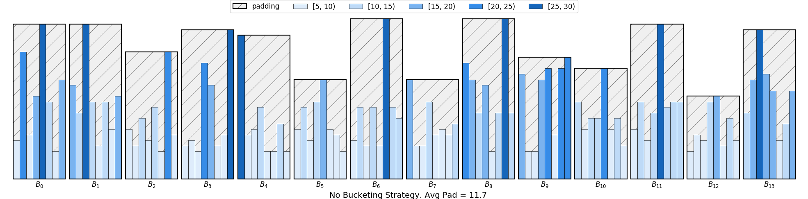
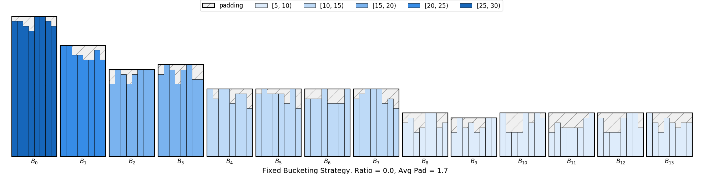
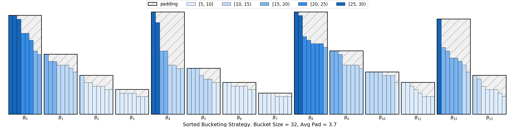

Data API — A Sentiment Analysis Example
---------------------------------------

In this tutorial, we show how to load and process the sentiment dataset to form batches that can be processed efficiently.
We use `IMDB <http://ai.stanford.edu/~amaas/data/sentiment/>`_
dataset as an example, where the dataset has 50,000 movie reviews, labeled as positive or negative. The dataset
is splitted into training/testing dataset, each consisting of 25,000 reviews.

Data Loading
~~~~~~~~~~~~

Let us see a quick example.

.. code:: python

    >>> import mxnet as mx
    >>> from mxnet import gluon, nd
    >>> import gluonnlp as nlp

.. code:: python

    >>> train_dataset, test_dataset = [nlp.data.IMDB(root='data/imdb', segment=segment)
    >>>                                for segment in ('train', 'test')]

.. code:: python

    >>> print('#training samples={:d}, #testing samples={:d}'.format(len(train_dataset),
    >>>                                                              len(test_dataset)))

    #training samples: 25000, #testing samples: 25000

.. code:: python

    >>> print(train_dataset[0])

    ['Bromwell High is a cartoon comedy. It ran at the same time as some other programs
    about school life, such as "Teachers". My 35 years in the teaching profession lead
    me to believe that Bromwell High\'s satire is much closer to reality than is "Teachers".
    The scramble to survive financially, the insightful students who can see right through
    their pathetic teachers\' pomp, the pettiness of the whole situation, all remind me of
    the schools I knew and their students. When I saw the episode in which a student repeatedly
    tried to burn down the school, I immediately recalled ......... at .......... High. A
    classic line: INSPECTOR: I\'m here to sack one of your teachers. STUDENT: Welcome to
    Bromwell High. I expect that many adults of my age think that Bromwell High is far fetched.
    What a pity that it isn\'t!', 9]

In the above example, we load ``train_dataset`` and ``test_dataset``, which are both SimpleDataset objects.

``SimpleDataset``: wrapper for lists and arrays. Each entry in the train_dataset is a [string, score] pair,
where the score falls into [1, 2, ..., 10]. Thus in the given example, 9 indicates a positive feedback on the movie.

Data Processing
~~~~~~~~~~~~~~~

The next step is to preprocess the data so that it can be used to train the model. The following code
shows how to tokenize the string and then clip the resultant list of tokens.

.. code:: python

    >>> tokenizer = nlp.data.SpacyTokenizer('en')
    >>> # We use 50 as maximum length for illustration
    >>> # For actual learning, we may use a large value such as 500
    >>> length_clip = nlp.data.ClipSequence(50)
    >>> seq, score = train_dataset[0]
    >>> print(length_clip(tokenizer(seq)))

    ['Bromwell', 'High', 'is', 'a', 'cartoon', 'comedy', '.', 'It', 'ran', 'at', 'the', 'same',
    'time', 'as', 'some', 'other', 'programs', 'about', 'school', 'life', ',', 'such', 'as',
    '"', 'Teachers', '"', '.', 'My', '35', 'years', 'in', 'the', 'teaching', 'profession', 'lead',
    'me', 'to', 'believe', 'that', 'Bromwell', 'High', "'s", 'satire', 'is', 'much', 'closer',
    'to', 'reality', 'than', 'is']

Now, we are ready to preprocess the whole dataset. The following code shows how to tokenize the dataset parallelly.

.. code:: python

    >>> import time
    >>> import multiprocessing as mp
    >>> length_clip = nlp.data.ClipSequence(500)

.. code:: python

    >>> # Dataset preprocessing
    >>> def preprocess(x):
    >>>     data, label = x
    >>>     # In the labeled train/test sets, a negative review has a score <= 4
    >>>     # out of 10, and a positive review has a score >= 7 out of 10. Thus
    >>>     # reviews with more neutral ratings are not included in the train/test
    >>>     # sets. We labeled a negative review whose score <= 4 as 0, and a
    >>>     # positive review whose score >= 7 as 1. As the neural ratings are not
    >>>     # included in the datasets, we can simply use 5 as our threshold.
    >>>     label = int(label > 5)
    >>>     data = length_clip(tokenizer(data))
    >>>     return data, label
    >>>
    >>> def get_length(x):
    >>>     return float(len(x[0]))
    >>>
    >>> def preprocess_dataset(dataset):
    >>>     start = time.time()
    >>>     pool = mp.Pool()
    >>>     dataset = gluon.data.SimpleDataset(pool.map(preprocess, dataset))
    >>>     lengths = gluon.data.SimpleDataset(pool.map(get_length, dataset))
    >>>     end = time.time()
    >>>     print('Done! Tokenizing Time={:.2f}s, #Sentences={}'.format(end - start, len(dataset)))
    >>>     return dataset, lengths
    >>>
    >>> # Preprocess the dataset
    >>> train_dataset, train_data_lengths = preprocess_dataset(train_dataset)
    >>> test_dataset, test_data_lengths = preprocess_dataset(test_dataset)

    Tokenize using spaCy...

    Done! Tokenizing Time=12.85s, #Sentences=25000

    Done! Tokenizing Time=12.99s, #Sentences=25000

Then, we are going to construct a vocabulary for the training dataset. The vocabulary will be used
to convert the tokens to numerical indices, which facilitates the creation of word embedding matrices.

.. code:: python

    >>> import itertools
    >>> train_seqs = [sample[0] for sample in train_dataset]
    >>> counter = nlp.data.count_tokens(list(itertools.chain.from_iterable(train_seqs)))
    >>> vocab = nlp.Vocab(counter, max_size=10000, padding_token=None,
    >>>                   bos_token=None, eos_token=None)
    >>> print(vocab)

    Vocab(size=10001, unk="<unk>", reserved="None")

.. code:: python

    >>> # Convert string token to its index in the dictionary
    >>> def token_to_idx(x):
    >>>     return vocab[x[0]], x[1]
    >>>
    >>> pool = mp.Pool()
    >>> train_dataset = pool.map(token_to_idx, train_dataset)
    >>> test_dataset = pool.map(token_to_idx, test_dataset)
    >>> pool.close()
    >>> print(train_dataset[0][0][:50])

    [0, 2012, 8, 4, 1116, 231, 3, 51, 2311, 40, 1, 188, 67, 20, 59, 97, 6190, 49, 422, 133,
    2, 160, 20, 13, 0, 13, 3, 374, 5063, 174, 9, 1, 5390, 6674, 498, 83, 7, 282, 12, 0, 2012,
    15, 2042, 8, 88, 2661, 7, 714, 87, 8]

Bucketing and Dataloader
~~~~~~~~~~~~~~~~~~~~~~~~

The next step is to construct a dataloader for training. As the sequences have variable lengths, we need to pad the
sequences so that they have the same lengths in the minibatch, which allows the fast tensor manipulation in GPU.

.. code:: python

   >>> batchify_fn = nlp.data.batchify.Tuple(nlp.data.batchify.Pad(axis=0),
   >>>                                       nlp.data.batchify.Stack())

``Tuple`` wraps multiple batchify functions and applies each input function on each input field, respectively. In this
case, we are applying ``Pad`` on the sequence and ``Stack`` on the labels. Given the batchify function, we can construct
the dataloaders for both training samples and testing samples.

.. code:: python

   >>> train_dataloader = gluon.data.DataLoader(dataset=train_dataset,
   >>>                                          shuffle=True,
   >>>                                          batchify_fn=batchify_fn)
   >>> test_dataloader = gluon.data.DataLoader(dataset=test_dataset,
   >>>                                         batch_size=batch_size,
   >>>                                         shuffle=False,
   >>>                                         batchify_fn=batchify_fn)

As ``Dataloader`` is iterable, we can iterate over the dataset easily using the following code:

.. code:: python

   >>> for data, label in train_dataloader:

In the above example, minibatcheas are formed using uniform sampling, which can cause a large amount of padding as shown
in the figure below.

In light of this, we consider
constructing a sampler using bucketing, which defines how the samples in a dataset will be iterated in a more economic way.

.. code:: python

    >>> batch_sampler = nlp.data.sampler.FixedBucketSampler(train_data_lengths,
    >>>                                                     batch_size=16,
    >>>                                                     num_buckets=10,
    >>>                                                     ratio=0,
    >>>                                                     shuffle=True)
    >>> print(batch_sampler.stats())

   FixedBucketSampler:
     sample_num=25000, batch_num=1567
     key=[68, 116, 164, 212, 260, 308, 356, 404, 452, 500]
     cnt=[981, 1958, 5686, 4614, 2813, 2000, 1411, 1129, 844, 3564]
     batch_size=[16, 16, 16, 16, 16, 16, 16, 16, 16, 16]

In this example, we use a ``FixedBucketSampler``, which assigns each data sample to a fixed bucket based on its length.
The bucket keys are either given or generated from the input sequence lengths. We construct 10 buckets, where `cnt`
shows the number of samples belonging to each bucket. A graphic illustration of using ``FixedBucketSampler`` can be
seen as follows:

To further improve the throughput, we can consider scaling up the batch size of smaller buckets. This can be achieved
by using a parameter ``ratio``. Assume the :math:`i` th key is :math:`K_i` , the default batch size is :math:`B` , the ratio to
scale the batch size is :math:`\alpha` and the batch size corresponds to the :math:`i` th bucket is :math:`B_i` . We have:

.. math::

   B_i = \max(\alpha B \times \frac{\max_j sum(K_j)}{sum(K_i)}, B)

Thus, setting this to a value larger than 0, like 0.5, will scale up the batch size of the
smaller buckets.

.. code:: python

    >>> batch_sampler = nlp.data.sampler.FixedBucketSampler(train_data_lengths,
    >>>                                                     batch_size=16,
    >>>                                                     num_buckets=10,
    >>>                                                     ratio=0.5,
    >>>                                                     shuffle=True)
    >>> print(batch_sampler.stats())

   FixedBucketSampler:
     sample_num=25000, batch_num=1306
     key=[68, 116, 164, 212, 260, 308, 356, 404, 452, 500]
     cnt=[981, 1958, 5686, 4614, 2813, 2000, 1411, 1129, 844, 3564]
     batch_size=[58, 34, 24, 18, 16, 16, 16, 16, 16, 16]

Now, we can create dataloader using bucketing sampler for both training set.

.. code:: python

   >>> train_dataloader = gluon.data.DataLoader(dataset=train_dataset,
   >>>                                          batch_sampler=batch_sampler,
   >>>                                          batchify_fn=batchify_fn)

In our sampler API, we also provide another sampler called ``SortedBucketSampler``, which results in the following
padding pattern:

With this strategy, we partition data to a number of buckets with size `batch_size * mult`, where `mult` is a multiplier 
to determine the bucket size. Each bucket contains `batch_size * mult` elements. The samples inside each bucket are sorted 
based on sort_key and then batched.

.. code:: python

    >>> batch_sampler = nlp.data.sampler.SortedBucketSampler(train_data_lengths,
    >>>                                                     batch_size=16,
    >>>                                                     mult=100,
    >>>                                                     shuffle=True)

More details about the training using pre-trained language model and bucketing can be found in the following:

.. toctree::
   :maxdepth: 1

   ../../examples/sentiment_analysis/sentiment_analysis.ipynb

