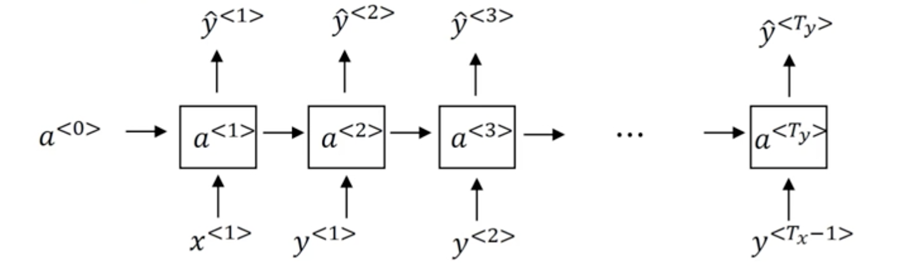
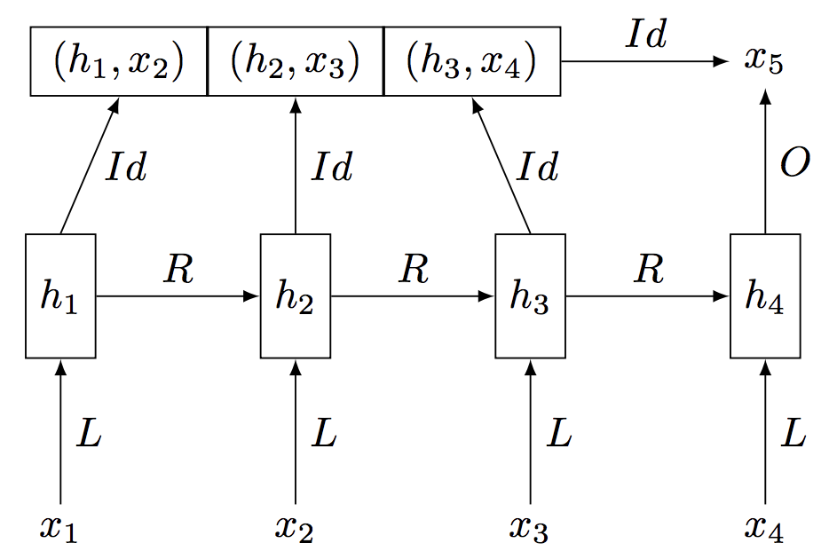

# Language Modeling using NLP Toolkit

In this notebook, we will go through an example of using Gluon NLP Toolkit to 1) define language model architecture, and train a standard LSTM language model; 2) use your own dataset to train the model; 3) and use the pre-trained state-of-the-art languague models in Gluon NLP Toolkit.

## Language model definition - one sentence

Language model is trying to predict the next word based on the previous ones.

<div style="width: 500px;"></div>

## Train your own language model

### Preparation

#### Load gluonnlp

```{.python .input  n=1}
import warnings
warnings.filterwarnings('ignore')

import time
import math

import mxnet as mx
from mxnet import gluon, autograd
from mxnet.gluon.utils import download

import gluonnlp as nlp
```

#### Set environment

```{.python .input  n=2}
num_gpus = 1
context = [mx.gpu(i) for i in range(num_gpus)] if num_gpus else [mx.cpu()]
log_interval = 200
```

#### Set hyperparameters

```{.python .input  n=3}
batch_size = 20 * len(context)
lr = 20
epochs = 3
bptt = 35
grad_clip = 0.25
```

#### Load dataset, extract vocabulary, numericalize, and batchify for truncated BPTT

```{.python .input  n=4}
dataset_name = 'wikitext-2'
train_dataset, val_dataset, test_dataset = [nlp.data.WikiText2(segment=segment,
                                                               bos=None, eos='<eos>',
                                                               skip_empty=False)
                                            for segment in ['train', 'val', 'test']]

vocab = nlp.Vocab(nlp.data.Counter(train_dataset[0]), padding_token=None, bos_token=None)

train_data, val_data, test_data = [x.bptt_batchify(vocab, bptt, batch_size,
                                                   last_batch='discard')
                                   for x in [train_dataset, val_dataset, test_dataset]]
```

#### Load pre-defined language model architecture

```{.python .input  n=5}
model_name = 'standard_lstm_lm_200'
model, vocab = nlp.model.get_model(model_name, vocab=vocab, dataset_name=None)
print(model)
print(vocab)
```

```{.json .output n=5}
[
 {
  "name": "stdout",
  "output_type": "stream",
  "text": "StandardRNN(\n  (embedding): HybridSequential(\n    (0): Embedding(33278 -> 200, float32)\n    (1): Dropout(p = 0.2, axes=())\n  )\n  (encoder): LSTM(200 -> 200.0, TNC, num_layers=2, dropout=0.2)\n  (decoder): HybridSequential(\n    (0): Dense(200 -> 33278, linear)\n  )\n)\nVocab(size=33278, unk=\"<unk>\", reserved=\"['<eos>']\")\n"
 }
]
```

```{.python .input  n=6}
model.initialize(mx.init.Xavier(), ctx=context)
trainer = gluon.Trainer(model.collect_params(), 'sgd',
                        {'learning_rate': lr,
                         'momentum': 0,
                         'wd': 0})
loss = gluon.loss.SoftmaxCrossEntropyLoss()
```

### Training

Now that everything is ready, we can start training the model.

#### Detach gradients on states for truncated BPTT

```{.python .input  n=7}
def detach(hidden):
    if isinstance(hidden, (tuple, list)):
        hidden = [detach(i) for i in hidden]
    else:
        hidden = hidden.detach()
    return hidden
```

#### Evaluation

```{.python .input  n=8}
def evaluate(model, data_source, batch_size, ctx):
    total_L = 0.0
    ntotal = 0
    hidden = model.begin_state(batch_size=batch_size, func=mx.nd.zeros, ctx=ctx)
    for i, (data, target) in enumerate(data_source):
        data = data.as_in_context(ctx)
        target = target.as_in_context(ctx)
        output, hidden = model(data, hidden)
        hidden = detach(hidden)
        L = loss(output.reshape(-3, -1),
                 target.reshape(-1))
        total_L += mx.nd.sum(L).asscalar()
        ntotal += L.size
    return total_L / ntotal
```

#### Training loop

We train the model using truncated [back-propagation-through-time (BPTT)](https://en.wikipedia.org/wiki/Backpropagation_through_time) . We backpropagate
for 35 time steps using stochastic gradient descent with the learning rate.

<div style="width: 500px;"></div>

```{.python .input  n=9}
def train(model, train_data, val_data, test_data, epochs, lr):
    best_val = float("Inf")
    start_train_time = time.time()
    parameters = model.collect_params().values()
    for epoch in range(epochs):
        total_L = 0.0
        start_epoch_time = time.time()
        start_log_interval_time = time.time()
        hiddens = [model.begin_state(batch_size//len(context), func=mx.nd.zeros, ctx=ctx)
                   for ctx in context]
        for i, (data, target) in enumerate(train_data):
            data_list = gluon.utils.split_and_load(data, context,
                                                   batch_axis=1, even_split=True)
            target_list = gluon.utils.split_and_load(target, context,
                                                     batch_axis=1, even_split=True)
            hiddens = detach(hiddens)
            L = 0
            Ls = []
            with autograd.record():
                for j, (X, y, h) in enumerate(zip(data_list, target_list, hiddens)):
                    output, h = model(X, h)
                    batch_L = loss(output.reshape(-3, -1), y.reshape(-1,))
                    L = L + batch_L.as_in_context(context[0]) / X.size
                    Ls.append(batch_L / X.size)
                    hiddens[j] = h
            L.backward()
            grads = [p.grad(x.context) for p in parameters for x in data_list]
            gluon.utils.clip_global_norm(grads, grad_clip)

            trainer.step(1)

            total_L += sum([mx.nd.sum(l).asscalar() for l in Ls])

            if i % log_interval == 0 and i > 0:
                cur_L = total_L / log_interval
                print('[Epoch %d Batch %d/%d] loss %.2f, ppl %.2f, '
                      'throughput %.2f samples/s'%(
                    epoch, i, len(train_data), cur_L, math.exp(cur_L),
                    batch_size * log_interval / (time.time() - start_log_interval_time)))
                total_L = 0.0
                start_log_interval_time = time.time()

        mx.nd.waitall()

        print('[Epoch %d] throughput %.2f samples/s'%(
                    epoch, len(train_data)*batch_size / (time.time() - start_epoch_time)))
        val_L = evaluate(model, val_data, batch_size, context[0])
        print('[Epoch %d] time cost %.2fs, valid loss %.2f, valid ppl %.2f'%(
            epoch, time.time()-start_epoch_time, val_L, math.exp(val_L)))

        if val_L < best_val:
            best_val = val_L
            test_L = evaluate(model, test_data, batch_size, context[0])
            model.save_params('{}_{}-{}.params'.format(model_name, dataset_name, epoch))
            print('test loss %.2f, test ppl %.2f'%(test_L, math.exp(test_L)))
        else:
            lr = lr*0.25
            print('Learning rate now %f'%(lr))
            trainer.set_learning_rate(lr)

    print('Total training throughput %.2f samples/s'%(
                            (batch_size * len(train_data) * epochs) /
                            (time.time() - start_train_time)))
```

#### Train and evaluate

```{.python .input  n=10}
train(model, train_data, val_data, test_data, epochs, lr)
```

```{.json .output n=10}
[
 {
  "name": "stdout",
  "output_type": "stream",
  "text": "[Epoch 0 Batch 200/2983] loss 7.64, ppl 2089.79, throughput 446.54 samples/s\n[Epoch 0 Batch 400/2983] loss 6.76, ppl 861.82, throughput 482.69 samples/s\n[Epoch 0 Batch 600/2983] loss 6.36, ppl 576.54, throughput 460.25 samples/s\n[Epoch 0 Batch 800/2983] loss 6.19, ppl 485.45, throughput 468.98 samples/s\n[Epoch 0 Batch 1000/2983] loss 6.05, ppl 422.70, throughput 468.24 samples/s\n[Epoch 0 Batch 1200/2983] loss 5.97, ppl 392.23, throughput 468.28 samples/s\n[Epoch 0 Batch 1400/2983] loss 5.86, ppl 351.95, throughput 470.69 samples/s\n[Epoch 0 Batch 1600/2983] loss 5.86, ppl 351.32, throughput 474.85 samples/s\n[Epoch 0 Batch 1800/2983] loss 5.70, ppl 300.08, throughput 463.90 samples/s\n[Epoch 0 Batch 2000/2983] loss 5.68, ppl 291.49, throughput 478.27 samples/s\n[Epoch 0 Batch 2200/2983] loss 5.57, ppl 261.19, throughput 461.97 samples/s\n[Epoch 0 Batch 2400/2983] loss 5.57, ppl 263.48, throughput 467.90 samples/s\n[Epoch 0 Batch 2600/2983] loss 5.56, ppl 260.52, throughput 466.79 samples/s\n[Epoch 0 Batch 2800/2983] loss 5.46, ppl 234.16, throughput 483.88 samples/s\n[Epoch 0] throughput 468.60 samples/s\n[Epoch 0] time cost 140.69s, valid loss 5.42, valid ppl 225.54\ntest loss 5.33, test ppl 207.38\n[Epoch 1 Batch 200/2983] loss 5.47, ppl 236.97, throughput 465.12 samples/s\n[Epoch 1 Batch 400/2983] loss 5.45, ppl 232.65, throughput 475.54 samples/s\n[Epoch 1 Batch 600/2983] loss 5.28, ppl 195.95, throughput 470.30 samples/s\n[Epoch 1 Batch 800/2983] loss 5.30, ppl 199.59, throughput 466.00 samples/s\n[Epoch 1 Batch 1000/2983] loss 5.27, ppl 194.16, throughput 461.56 samples/s\n[Epoch 1 Batch 1200/2983] loss 5.27, ppl 193.64, throughput 474.85 samples/s\n[Epoch 1 Batch 1400/2983] loss 5.27, ppl 193.52, throughput 465.61 samples/s\n[Epoch 1 Batch 1600/2983] loss 5.32, ppl 205.30, throughput 471.76 samples/s\n[Epoch 1 Batch 1800/2983] loss 5.19, ppl 180.18, throughput 472.74 samples/s\n[Epoch 1 Batch 2000/2983] loss 5.21, ppl 183.12, throughput 472.52 samples/s\n[Epoch 1 Batch 2200/2983] loss 5.11, ppl 166.26, throughput 453.79 samples/s\n[Epoch 1 Batch 2400/2983] loss 5.15, ppl 172.44, throughput 466.28 samples/s\n[Epoch 1 Batch 2600/2983] loss 5.16, ppl 174.59, throughput 467.11 samples/s\n[Epoch 1 Batch 2800/2983] loss 5.08, ppl 160.55, throughput 478.30 samples/s\n[Epoch 1] throughput 469.13 samples/s\n[Epoch 1] time cost 140.68s, valid loss 5.16, valid ppl 173.61\ntest loss 5.08, test ppl 161.41\n[Epoch 2 Batch 200/2983] loss 5.14, ppl 170.93, throughput 475.49 samples/s\n[Epoch 2 Batch 400/2983] loss 5.16, ppl 173.32, throughput 467.18 samples/s\n[Epoch 2 Batch 600/2983] loss 4.98, ppl 145.02, throughput 470.24 samples/s\n[Epoch 2 Batch 800/2983] loss 5.02, ppl 151.83, throughput 472.50 samples/s\n[Epoch 2 Batch 1000/2983] loss 5.01, ppl 150.59, throughput 471.60 samples/s\n[Epoch 2 Batch 1200/2983] loss 5.02, ppl 151.78, throughput 462.04 samples/s\n[Epoch 2 Batch 1400/2983] loss 5.04, ppl 154.65, throughput 478.07 samples/s\n[Epoch 2 Batch 1600/2983] loss 5.11, ppl 166.48, throughput 460.62 samples/s\n[Epoch 2 Batch 1800/2983] loss 4.99, ppl 146.91, throughput 458.84 samples/s\n[Epoch 2 Batch 2000/2983] loss 5.02, ppl 151.34, throughput 476.41 samples/s\n[Epoch 2 Batch 2200/2983] loss 4.92, ppl 136.65, throughput 481.40 samples/s\n[Epoch 2 Batch 2400/2983] loss 4.96, ppl 142.54, throughput 456.40 samples/s\n[Epoch 2 Batch 2600/2983] loss 4.98, ppl 145.22, throughput 468.38 samples/s\n[Epoch 2 Batch 2800/2983] loss 4.91, ppl 135.03, throughput 483.04 samples/s\n[Epoch 2] throughput 469.38 samples/s\n[Epoch 2] time cost 140.54s, valid loss 5.06, valid ppl 158.35\ntest loss 5.00, test ppl 147.84\nTotal training throughput 383.09 samples/s\n"
 }
]
```

## Use your own dataset

```{.python .input  n=11}
TRAIN_PATH = "./sherlockholmes.train.txt"
VALID_PATH = "./sherlockholmes.valid.txt"
TEST_PATH = "./sherlockholmes.test.txt"
PREDICT_PATH = "./tinyshakespeare/input.txt"
download(
        "https://raw.githubusercontent.com/dmlc/web-data/master/mxnet/sherlockholmes/sherlockholmes.train.txt",
        TRAIN_PATH,
        sha1_hash="d65a52baaf32df613d4942e0254c81cff37da5e8")
download(
        "https://raw.githubusercontent.com/dmlc/web-data/master/mxnet/sherlockholmes/sherlockholmes.valid.txt",
        VALID_PATH,
        sha1_hash="71133db736a0ff6d5f024bb64b4a0672b31fc6b3")
download(
        "https://raw.githubusercontent.com/dmlc/web-data/master/mxnet/sherlockholmes/sherlockholmes.test.txt",
        TEST_PATH,
        sha1_hash="b7ccc4778fd3296c515a3c21ed79e9c2ee249f70")
download(
        "https://raw.githubusercontent.com/dmlc/web-data/master/mxnet/tinyshakespeare/input.txt",
        PREDICT_PATH,
        sha1_hash="04486597058d11dcc2c556b1d0433891eb639d2e")
sherlockholmes_dataset = !ls sherlockholmes.*.txt
print(sherlockholmes_dataset)
```

```{.json .output n=11}
[
 {
  "name": "stdout",
  "output_type": "stream",
  "text": "Downloading ./sherlockholmes.train.txt from https://raw.githubusercontent.com/dmlc/web-data/master/mxnet/sherlockholmes/sherlockholmes.train.txt...\nDownloading ./sherlockholmes.valid.txt from https://raw.githubusercontent.com/dmlc/web-data/master/mxnet/sherlockholmes/sherlockholmes.valid.txt...\nDownloading ./sherlockholmes.test.txt from https://raw.githubusercontent.com/dmlc/web-data/master/mxnet/sherlockholmes/sherlockholmes.test.txt...\n['sherlockholmes.test.txt', 'sherlockholmes.train.txt', 'sherlockholmes.valid.txt']\n"
 }
]
```

```{.python .input  n=12}
import nltk
moses_tokenizer = nlp.data.NLTKMosesTokenizer()

sherlockholmes_val = nlp.data.LanguageModelDataset('sherlockholmes.valid.txt',
                                        sample_splitter=nltk.tokenize.sent_tokenize,
                                        tokenizer=moses_tokenizer, eos='<eos>')

sherlockholmes_val_data = sherlockholmes_val.bptt_batchify(vocab, bptt, batch_size, last_batch='discard')
```

```{.python .input  n=13}
sherlockholmes_L = evaluate(model, sherlockholmes_val_data, batch_size, context[0])
print('Best validation loss %.2f, test ppl %.2f'%(sherlockholmes_L, math.exp(sherlockholmes_L)))
```

```{.json .output n=13}
[
 {
  "name": "stdout",
  "output_type": "stream",
  "text": "Best validation loss 5.31, test ppl 202.19\n"
 }
]
```

```{.python .input  n=14}
train(model, sherlockholmes_val_data, sherlockholmes_val_data, sherlockholmes_val_data, epochs=3, lr=20)
```

```{.json .output n=14}
[
 {
  "name": "stdout",
  "output_type": "stream",
  "text": "[Epoch 0] throughput 279.01 samples/s\n[Epoch 0] time cost 4.36s, valid loss 3.86, valid ppl 47.57\ntest loss 3.86, test ppl 47.57\n[Epoch 1] throughput 292.67 samples/s\n[Epoch 1] time cost 4.23s, valid loss 3.69, valid ppl 40.15\ntest loss 3.69, test ppl 40.15\n[Epoch 2] throughput 292.89 samples/s\n[Epoch 2] time cost 4.23s, valid loss 3.65, valid ppl 38.29\ntest loss 3.65, test ppl 38.29\nTotal training throughput 136.19 samples/s\n"
 }
]
```

## Use pretrained state-of-the-art language models

### Use AWD LSTM language model

AWD LSTM language model is the state-of-the-art RNN language model [1]. The main technique is to add weight-dropout on the recurrent hidden to hidden matrices to prevent the overfitting from occurring on the recurrent connections.

#### Load vocabulary and pretrained model

```{.python .input  n=15}
awd_model_name = 'awd_lstm_lm_1150'
awd_model, vocab = nlp.model.get_model(awd_model_name, vocab=vocab, dataset_name=dataset_name,
                                   pretrained=True, ctx=context[0])
print(awd_model)
print(vocab)
```

```{.json .output n=15}
[
 {
  "name": "stdout",
  "output_type": "stream",
  "text": "AWDRNN(\n  (embedding): HybridSequential(\n    (0): Embedding(33278 -> 400, float32)\n    (1): Dropout(p = 0.65, axes=(0,))\n  )\n  (encoder): Sequential(\n    (0): LSTM(400 -> 1150.0, TNC)\n    (1): LSTM(1150 -> 1150.0, TNC)\n    (2): LSTM(1150 -> 400.0, TNC)\n  )\n  (decoder): HybridSequential(\n    (0): Dense(400 -> 33278, linear)\n  )\n)\nVocab(size=33278, unk=\"<unk>\", reserved=\"['<eos>']\")\n"
 }
]
```

#### Evaluate the pretrained model on val and test datasets

```{.python .input  n=16}
val_L = evaluate(awd_model, val_data, batch_size, context[0])
test_L = evaluate(awd_model, test_data, batch_size, context[0])
print('Best validation loss %.2f, val ppl %.2f'%(val_L, math.exp(val_L)))
print('Best test loss %.2f, test ppl %.2f'%(test_L, math.exp(test_L)))
```

```{.json .output n=16}
[
 {
  "name": "stdout",
  "output_type": "stream",
  "text": "Best validation loss 4.30, val ppl 73.44\nBest test loss 4.25, test ppl 69.81\n"
 }
]
```

### Use Cache LSTM language model

Cache LSTM language model [2] adds a cache-like memory to neural network language models, e.g., AWD LSTM language model. It exploits the hidden outputs to define a probability distribution over the words in the cache. It generates the state-of-the-art results in inference time.

<div style="width: 500px;"></div>

#### Load pretrained model and define hyperparameters

```{.python .input  n=17}
window = 2
theta = 0.662
lambdas = 0.1279
bptt = 2000
cache_model = nlp.model.train.get_cache_model(name=awd_model_name,
                                             dataset_name=dataset_name,
                                             window=window,
                                             theta=theta,
                                             lambdas=lambdas,
                                             ctx=context[0])
print(cache_model)
```

```{.json .output n=17}
[
 {
  "name": "stdout",
  "output_type": "stream",
  "text": "CacheCell(\n  (lm_model): AWDRNN(\n    (embedding): HybridSequential(\n      (0): Embedding(33278 -> 400, float32)\n      (1): Dropout(p = 0.65, axes=(0,))\n    )\n    (encoder): Sequential(\n      (0): LSTM(400 -> 1150.0, TNC)\n      (1): LSTM(1150 -> 1150.0, TNC)\n      (2): LSTM(1150 -> 400.0, TNC)\n    )\n    (decoder): HybridSequential(\n      (0): Dense(400 -> 33278, linear)\n    )\n  )\n)\n"
 }
]
```

#### Define specific get_batch and evaluation for cache model

```{.python .input  n=18}
val_batch_size = 1
val_data = val_dataset.batchify(vocab, val_batch_size)
test_batch_size = 1
test_data = test_dataset.batchify(vocab, test_batch_size)
```

```{.python .input  n=19}
def get_batch(data_source, i, seq_len=None):
    seq_len = min(seq_len if seq_len else bptt, len(data_source) - 1 - i)
    data = data_source[i:i+seq_len]
    target = data_source[i+1:i+1+seq_len]
    return data, target
```

```{.python .input  n=20}
def evaluate_cache(model, data_source, batch_size, ctx):
    total_L = 0.0
    hidden = model.begin_state(batch_size=batch_size, func=mx.nd.zeros, ctx=ctx)
    next_word_history = None
    cache_history = None
    for i in range(0, len(data_source) - 1, bptt):
        if i > 0:
            print('Batch %d, ppl %f'%
                  (i, math.exp(total_L/i)))
        if i == bptt:
            return total_L/i
        data, target = get_batch(data_source, i)
        data = data.as_in_context(ctx)
        target = target.as_in_context(ctx)
        L = 0
        outs, next_word_history, cache_history, hidden = model(data, target,
                                                               next_word_history,
                                                               cache_history,
                                                               hidden)
        for out in outs:
            L += (-mx.nd.log(out)).asscalar()
        total_L += L / data.shape[1]
        hidden = detach(hidden)
    return total_L / len(data_source)
```

#### Evaluate the pretrained model on val and test datasets

```{.python .input  n=21}
val_L = evaluate_cache(cache_model, val_data, val_batch_size, context[0])
test_L = evaluate_cache(cache_model, test_data, val_batch_size, context[0])
print('Best validation loss %.2f, val ppl %.2f'%(val_L, math.exp(val_L)))
print('Best test loss %.2f, test ppl %.2f'%(test_L, math.exp(test_L)))
```

```{.json .output n=21}
[
 {
  "name": "stdout",
  "output_type": "stream",
  "text": "Batch 2000, ppl 65.772428\nBatch 2000, ppl 71.184105\nBest validation loss 4.19, val ppl 65.77\nBest test loss 4.27, test ppl 71.18\n"
 }
]
```

## Conclusion

- Showcase with language model, we already support embedding training, sentiment analysis, beam search, and NMT in a similar easy-to-use fashion, and more is on the way.
- Gluon NLP Toolkit provides high-level APIs that could drastically simplify the development process of modeling for NLP tasks.
- Low-level APIs in NLP Toolkit enables easy customization.

Documentation can be found at http://gluon-nlp.mxnet.io/index.html

Code is here https://github.com/dmlc/gluon-nlp

## Reference

[1] Merity, S., et al. “Regularizing and optimizing LSTM language models”. ICLR 2018

[2] Grave, E., et al. “Improving neural language models with a continuous cache”. ICLR 2017
