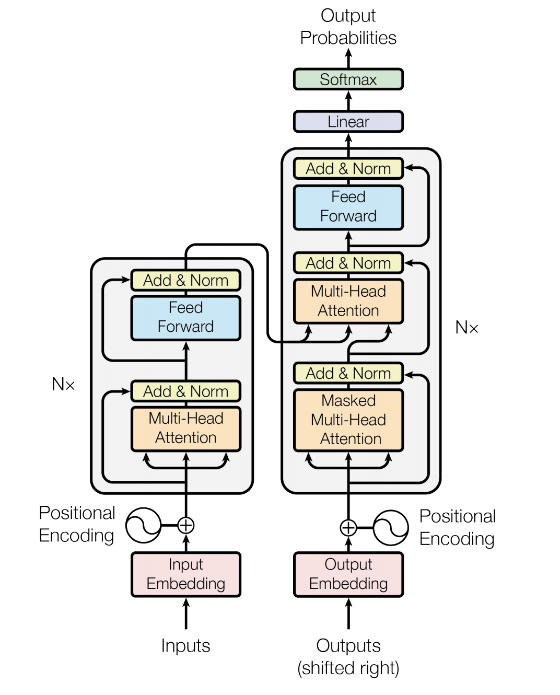

# Machine Translation with Transformers

In this notebook, we will show how to use Transformer introduced in [1] and evaluate the pre-trained model with GluonNLP. Transformer model is shown to be more accurate and easier to parallelize than previous seq2seq-based models such as Google Neural Machine Translation. We will use the state-of-the-art pre-trained Transformer model, evaluate the pre-trained Transformer model on newstest2014 and translate a few sentences ourselves with the `BeamSearchTranslator`;

## Setup

We start with some usual preparation such as importing libraries and setting the environment.


### Load MXNet and GluonNLP

```{.python .input}
import warnings
warnings.filterwarnings('ignore')

import random
import numpy as np
import mxnet as mx
from mxnet import gluon
import gluonnlp as nlp
```

### Setup the environment

```{.python .input}
np.random.seed(100)
random.seed(100)
mx.random.seed(10000)
ctx = mx.gpu(0)
```

## Using the pre-trained transformer model

Next, we load the Transformer model in GluonNLP model zoo and use the full `newstest2014` segment of the WMT 2014 English-German test dataset, and evaluate the model on it.

### Load the transformer

We load the pre-trained Transformer using the model API in GluonNLP, which returns the source and target vocabulary along with the model.

```{.python .input}
import nmt

wmt_model_name = 'transformer_en_de_512'

wmt_transformer_model, wmt_src_vocab, wmt_tgt_vocab = \
    nlp.model.get_model(wmt_model_name,
                        dataset_name='WMT2014',
                        pretrained=True,
                        ctx=ctx)

# we are using mixed vocab of EN-DE, so the source and target language vocab are the same
print(len(wmt_src_vocab), len(wmt_tgt_vocab))
```

The Transformer model architecture is shown as below:

<div style="width: 500px;"></div>

### Load and preprocess the dataset

We then load the `newstest2014` segment in the WMT 2014 English-German test dataset for evaluation purpose.

The following shows how to process the dataset and cache the processed dataset
for the future use. The processing steps include:

1) clip the source and target sequences
2) split the string input to a list of tokens
3) map the string token into its index in the vocabulary
4) append EOS token to source sentence and add BOS and EOS tokens to target sentence.

Let's first look at the WMT 2014 corpus. GluonNLP provides [WMT2014BPE](../../api/modules/data.rst#gluonnlp.data.WMT2014BPE)
and [WMT2014](../../api/modules/data.rst#gluonnlp.data.WMT2014) classes. The former contains BPE-tokenized dataset, while
the later contains the raw text. Here, we use the former for scoring, and the later for
demonstrating actual translation.

```{.python .input}
import hyperparameters as hparams

wmt_data_test = nlp.data.WMT2014BPE('newstest2014',
                                    src_lang=hparams.src_lang,
                                    tgt_lang=hparams.tgt_lang)
print('Source language %s, Target language %s' % (hparams.src_lang, hparams.tgt_lang))
print('Sample BPE tokens: "{}"'.format(wmt_data_test[0]))

wmt_test_text = nlp.data.WMT2014('newstest2014',
                                 src_lang=hparams.src_lang,
                                 tgt_lang=hparams.tgt_lang)
print('Sample raw text: "{}"'.format(wmt_test_text[0]))

wmt_test_tgt_sentences = wmt_test_text.transform(lambda src, tgt: tgt)
print('Sample target sentence: "{}"'.format(wmt_test_tgt_sentences[0]))
```

```{.python .input}
import dataprocessor

print(dataprocessor.TrainValDataTransform.__doc__)

# wmt_transform_fn includes the four preprocessing steps mentioned above.
wmt_transform_fn = dataprocessor.TrainValDataTransform(wmt_src_vocab, wmt_tgt_vocab)
wmt_dataset_processed = wmt_data_test.transform(wmt_transform_fn, lazy=False)
print(*wmt_dataset_processed[0], sep='\n')

def get_length_index_fn():
    global idx
    idx = 0
    def transform(src, tgt):
        global idx
        result = (src, tgt, len(src), len(tgt), idx)
        idx += 1
        return result
    return transform

wmt_data_test_with_len = wmt_dataset_processed.transform(get_length_index_fn(), lazy=False)
```

### Create the sampler and `DataLoader`

Now, we have obtained the transformed datasets. The next step is to construct the sampler and `DataLoader`. First, we need to construct the batchify function, which pads and stacks sequences to form mini-batches.

```{.python .input}
wmt_test_batchify_fn = nlp.data.batchify.Tuple(
    nlp.data.batchify.Pad(),
    nlp.data.batchify.Pad(),
    nlp.data.batchify.Stack(dtype='float32'),
    nlp.data.batchify.Stack(dtype='float32'),
    nlp.data.batchify.Stack())
```

In GluonNLP, all dataset items are tuples. In the preprocessed `wmt_data_test_with_len`, it includes
`(src, tgt, len(src), len(tgt), idx)` elements. In order to express how we'd like to batchify them, we use the built-in batchify functions.

* [Tuple](../../api/modules/data.batchify.rst#gluonnlp.data.batchify.Tuple) is the GluonNLP way of applying different batchify functions to each element of a dataset item. In this case, we are applying `Pad` to `src` and `tgt`, `Stack` to `len(src)` and `len(tgt)` with conversion to float32, and simple `Stack` to `idx` without type conversion.
* [Pad](../../api/modules/data.batchify.rst#gluonnlp.data.batchify.Pad) takes the elements from all dataset items in a batch, and pad them according to the item of maximum length to form a padded matrix/tensor.
* [Stack](../../api/modules/data.batchify.rst#gluonnlp.data.batchify.Stack) simply stacks all elements in a batch, and requires all elements to be of the same length.


We can then construct bucketing samplers, which generate batches by grouping sequences with similar lengths. Here, we use [FixedBucketSampler](../../api/modules/data.rst#gluonnlp.data.FixedBucketSampler) with [ExpWidthBucket](../../api/modules/data.rst#gluonnlp.data.ExpWidthBucket). FixedBucketSampler aims to assign each data sample to a fixed bucket based on its length. With this setting, the sampler would select buckets following an approximately exponentially increasing interval of maximum bucket lengths.

```{.python .input}
wmt_bucket_scheme = nlp.data.ExpWidthBucket(bucket_len_step=1.2)
wmt_test_batch_sampler = nlp.data.FixedBucketSampler(
    lengths=wmt_data_test_with_len.transform(lambda src, tgt, src_len, tgt_len, idx: tgt_len), # target length
    use_average_length=True, # control the element lengths (i.e. number of tokens) to be about the same
    bucket_scheme=wmt_bucket_scheme,
    batch_size=256)
print(wmt_test_batch_sampler.stats())
```

Given the samplers, we can use a `[DataLoader]`(https://mxnet.apache.org/versions/master/api/python/gluon/data.html#mxnet.gluon.data.DataLoader) to sample the datasets.

```{.python .input}
wmt_test_data_loader = gluon.data.DataLoader(
    wmt_data_test_with_len,
    batch_sampler=wmt_test_batch_sampler,
    batchify_fn=wmt_test_batchify_fn,
    num_workers=8)
len(wmt_test_data_loader)
```

### Evaluating the transformer

Next, we evaluate the performance of the model on the WMT test dataset. We first define the `BeamSearchTranslator` to generate the actual translations.

```{.python .input}
wmt_translator = nmt.translation.BeamSearchTranslator(
    model=wmt_transformer_model,
    beam_size=hparams.beam_size,
    scorer=nlp.model.BeamSearchScorer(alpha=hparams.lp_alpha, K=hparams.lp_k),
    max_length=200)
```

Then we calculate the `loss` as well as the `bleu` score on the `newstest2014` WMT 2014 English-German test dataset. This may take a while.

```{.python .input}
import time
import utils

eval_start_time = time.time()

wmt_test_loss_function = nlp.loss.MaskedSoftmaxCELoss()
wmt_test_loss_function.hybridize()

wmt_detokenizer = nlp.data.SacreMosesDetokenizer()

wmt_test_loss, wmt_test_translation_out = utils.evaluate(wmt_transformer_model,
                                                         wmt_test_data_loader,
                                                         wmt_test_loss_function,
                                                         wmt_translator,
                                                         wmt_tgt_vocab,
                                                         wmt_detokenizer,
                                                         ctx)

wmt_test_bleu_score, _, _, _, _ = nmt.bleu.compute_bleu([wmt_test_tgt_sentences],
                                                        wmt_test_translation_out,
                                                        tokenized=False,
                                                        tokenizer=hparams.bleu,
                                                        split_compound_word=False,
                                                        bpe=False)

print('WMT14 EN-DE SOTA model test loss: %.2f; test bleu score: %.2f; time cost %.2fs'
      %(wmt_test_loss, wmt_test_bleu_score * 100, (time.time() - eval_start_time)))
```

```{.python .input}
print('Sample translations:')
num_pairs = 3

for i in range(num_pairs):
    print('EN:')
    print(wmt_test_text[i][0])
    print('DE-Candidate:')
    print(wmt_test_translation_out[i])
    print('DE-Reference:')
    print(wmt_test_tgt_sentences[i])
    print('========')
```

### Translation Inference

We now show the actual translation example (EN-DE) when given a source language using the SOTA Transformer model.

```{.python .input}
import utils

print('Translate the following English sentence into German:')

sample_src_seq = 'We love language .'

print('[\'' + sample_src_seq + '\']')

sample_tgt_seq = utils.translate(wmt_translator,
                                 sample_src_seq,
                                 wmt_src_vocab,
                                 wmt_tgt_vocab,
                                 wmt_detokenizer,
                                 ctx)

print('The German translation is:')
print(sample_tgt_seq)
```

If you'd like to train your own transformer models, you may find the training scripts in our
[model zoo](../../model_zoo/machine_translation/index.rst).

## References

[1] Vaswani, Ashish, et al. "Attention is all you need." Advances in Neural Information Processing Systems. 2017.
