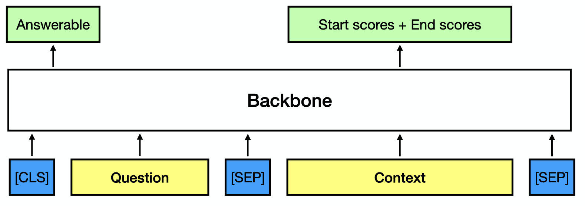
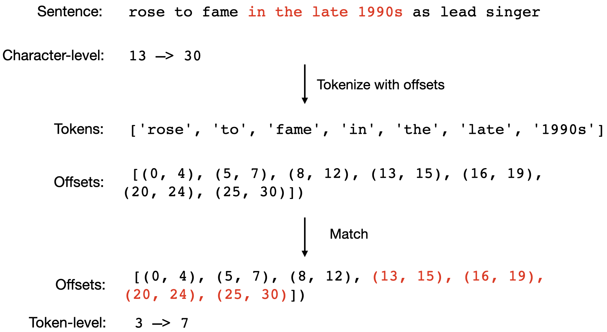
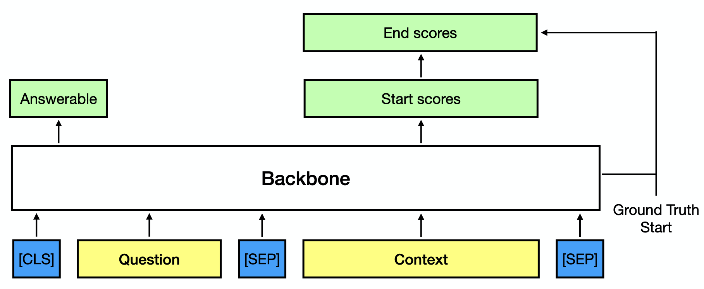

# Question Answering with GluonNLP

In this section, you will learn how to build a model for Question Answering (QA) based on the backbone provided in GluonNLP. We will use the Stanford Question Answering Dataset ([SQuAD dataset](https://rajpurkar.github.io/SQuAD-explorer/)) to illustrate the idea. We will cover the following in this tutorial:

- Understand the SQuAD 2.0 dataset and task.
- Understand how to build the model.
- Load a pretrained model for inference.


Let's first import the related packages. The `squad_utils` is a version based on [squad_utils.py](https://github.com/dmlc/gluon-nlp/blob/8ec0cc7965a096fe064bf9d73d5c64d5f3b2b0cc/scripts/question_answering/squad_utils.py).


```{.python .input}
import functools
from multiprocessing import Pool, cpu_count
import numpy as np
from termcolor import colored
import mxnet as mx
from mxnet.gluon import nn
from mxnet.gluon.nn import HybridBlock
import gluonnlp
from gluonnlp.layers import get_activation
from gluonnlp.models import get_backbone
from gluonnlp.utils.preprocessing import match_tokens_with_char_spans
from gluonnlp.utils.misc import get_mxnet_visible_ctx
from squad_utils import normalize_answer, get_squad_examples_from_json, \
                        convert_squad_example_to_feature, ModelForQAConditionalV1, \
                        SquadDatasetProcessor, RawResultExtended, predict_extended
mx.npx.set_np()
```

## Understand SQuAD 2.0

Let's first use the `nlp_data` CLI tool to download the SQuAD 2.0 dataset.


```{.python .input}
!nlp_data prepare_squad --version 2.0
!ls squad
```

We load the training data and validation data via the utility function.


```{.python .input}
train_examples = get_squad_examples_from_json('squad/train-v2.0.json', is_training=True)
dev_examples = get_squad_examples_from_json('squad/dev-v2.0.json', is_training=True)
```

Next, let's view some samples in the dataset to understand the question answering task.


```{.python .input}
def print_with_highlight(text, start_pos, end_pos):
    print(text[:start_pos], end='')
    print(colored(text[start_pos:end_pos], 'red', attrs=['bold']), end='')
    print(text[end_pos:])

def print_example(example):
    print('Context:')
    print('--------')
    if example.answer_text is not None:
        print_with_highlight(example.context_text, example.start_position, example.end_position)
    else:
        print(example.context_text)
    print()
    print('Question:')
    print('---------')
    print(example.query_text)
    print()
    print('Answer:')
    print('-------')
    print(example.answer_text)
    print()
    if example.answer_text is not None:
        print('Start + end position in Context:')
        print('--------------------------------')
        print(example.start_position, ',', example.end_position)
```

The answer is actually part of the context. Thus, we need to predict the **span**.


```{.python .input}
print_example(train_examples[0])
```

In addition, in SQuAD 2.0, there are questions that are **unanswerable**. The following is an example:


```{.python .input}
print_example(train_examples[2075])
```

## How to Build the Model

After investigating the SQuAD 2.0 dataset, we know that the outputs are
- answerable score
- start position
- end position

The inputs are
- context
- question

### Basic Architecture with Pretrained Model

We can try to tokenize the question and context and use the following model architecture, in which we predict the answerable score based on the sentence-level embedding and predict the score of each token for being start/end with the token-level embedding. The input and network architecture is illustrated as follows. We will add `softmax` layer after the start and end scores to get the probability of being start/end for each token.

<center>$p(y_{\text{ans}}, y_{\text{start}}, y_{\text{end}} \mid X) = p(y_{\text{ans}} \mid X) \cdot p(y_{\text{start}} \mid X) \cdot p(y_{\text{end}} \mid X)$</center>

<center></center>

### Character-level offsets --> Token-level offsets

There is one missing piece in the aforementioned architecture: how to convert the start position and end position, which are stored in **character-level** to **token-level**. The `encode_with_offsets` functionality is designed to solve this problem and will be explained later.

We can first encode the context to tokens + offsets and then search for the tokens that can cover the answer span. This will be very efficient based on binary search.

<center></center>

To illustrate how to implement the algorithm with GluonNLP, let's load the [ELECTRA](https://openreview.net/pdf?id=r1xMH1BtvB) model and use its tokenizer for illustration.


```{.python .input}
model_cls, cfg, tokenizer, local_params_path, _  = get_backbone('google_electra_base')
```


```{.python .input}
example = train_examples[0]
tokens, offsets = tokenizer.encode_with_offsets(example.context_text)
```


```{.python .input}
token_level_start_end = match_tokens_with_char_spans(offsets,
                                                     [[example.start_position,
                                                       example.end_position]])
token_start_pos = token_level_start_end[0][0]
token_end_pos = token_level_start_end[0][1]
print('Char-level start =', example.start_position, ', Char-level end =', example.end_position)
print('Token-level start =', token_start_pos, ', Token-level end =', token_end_pos)
print('Chosen tokens:', tokens[token_start_pos:token_end_pos+1])
print('Reconstructed:', tokenizer.decode(tokens[token_start_pos:token_end_pos+1]))
print('Ground-Truth:', example.answer_text)
```

In the following, we call the `convert_squad_example_to_feature` that is defined in squad_utils.py. This will convert character-level start and end to the token-level start and ends using the aforementioned algorithm.


```{.python .input}
train_feature = convert_squad_example_to_feature(tokenizer=tokenizer, example=train_examples[0], is_training=True)
```

### Conditional Architecture

There is correlation between the end position and start position. If we know that the start of the answer is at *"in"*, it will be easier for us to predict that the end is that "1990s". We can capture this correlation by decomposing the joint probability.

\begin{align}
p(y_{\text{ans}}, y_{\text{start}}, y_{\text{end}} \mid X) = p(y_{\text{ans}} \mid X)\cdot p(y_{\text{start}} \mid X) \cdot p(y_{\text{end}} \mid y_{\text{start}}, X)
\end{align}

<center></center>

One advantage of this conditional architecture is that we can use [beam search](https://d2l.ai/chapter_recurrent-modern/beam-search.html) to first sample the promising starting positions, and then sample the end positions based on the starting positions.

Here, we have implemented the conditional architecture in squad_utils.py. We won't go into the details. By inserting the architecture on top of the backbone model, we are able to build a model for SQuAD.


```{.python .input}
ctx = get_mxnet_visible_ctx()
backbone = model_cls.from_cfg(cfg, use_pooler=False)
qa_net = ModelForQAConditionalV1(backbone)
qa_net.hybridize()
```

### Handle Long Documents by Chunking

In most pretrained models, there is a maximum length constraint that limits the length of the sentence that the model can deal with. For example, in BERT-like models including ALBERT, MobileBERT, ELECTRA, the maximum number of tokens is 512.

What should we do if the "context" and "question" are too long so the concatenated input exceeds the maximum length? The common approach is to chunk the long document. 

For example, we can chunk the sentence "the man went to the store and bought a gallon of milk" with `stride=3` and `length=5`.
- Chunk 1: the man went to the
- Chunk 2: to the store and bought
- Chunk 3: and bought a gallon of
- Chunk 4: gallon of milk

We use the SQuAD data processor to process the training data. Internally, it will chunk the samples.


```{.python .input}
processor = SquadDatasetProcessor(tokenizer=tokenizer,
                                  doc_stride=128,
                                  max_seq_length=512,
                                  max_query_length=64)
```


```{.python .input}
example = train_examples[1718]
train_feature = convert_squad_example_to_feature(tokenizer=tokenizer,
                                                 example=example,
                                                 is_training=True)
chunks = processor.process_sample(train_feature)
print('Number of chunks=', len(chunks))
print_example(example)
```

### Training

Here, we won't show the complete training loop. For readers that are interested in the training function, you can refer to the source code in https://github.com/dmlc/gluon-nlp/tree/master/scripts/question_answering.

The optimization objective that we will use is to $\min_{\theta} -\log p(\text{answerable}) - \log p(\text{start})- \log p(\text{end}))$

## Inference with a Pretrained Model

Here, we will load pretrained weights and predict the answer. We will use beam search to select `5` start positions. Each start position corresponds to `5` end positions.


```{.python .input}
!wget -O google_electra_base_squad2.0_8160.params https://gluon-nlp-log.s3.amazonaws.com/squad_training_log/fintune_google_electra_base_squad_2.0/google_electra_base_squad2.0_8160.params
start_top_n = 5
end_top_n = 5
not_answerable_threshold = -1.7304818630218506  # This is obtained by selecting the best threshold on the dev set
```

We can create the `predict_qa` function to predict the result. Internally, it will use beam search and will vote based on the inference results of different chunks, and beams.


```{.python .input}
def predict_qa(sample, ctx, start_top_n, end_top_n, n_best_size=20, max_answer_length=64):
    # Step-1: Get Chunk Feature
    original_feature = convert_squad_example_to_feature(tokenizer=tokenizer,
                                                        example=sample,
                                                        is_training=False)
    chunked_features = processor.process_sample(original_feature)
    
    # Step-2: Use Batchify to convert to batch
    inference_batch = processor.BatchifyFunction(chunked_features)
    
    # Step-3: Move to the context
    tokens = inference_batch.data.as_in_ctx(ctx)
    segment_ids = inference_batch.segment_ids.as_in_ctx(ctx)
    valid_length = inference_batch.valid_length.as_in_ctx(ctx)
    masks = inference_batch.masks.as_in_ctx(ctx)
    p_mask = 1 - masks  # In the network, we use 1 --> no_mask, 0 --> mask
    
    # Step-4: Use qa_net.inference to get the logits
    start_top_logits, start_top_index, end_top_logits, end_top_index, answerable_logits \
        = qa_net.inference(tokens, segment_ids,
                           valid_length, p_mask,
                           start_top_n, end_top_n)
    result = RawResultExtended(qas_id=sample.qas_id,
                               start_top_logits=start_top_logits[0].asnumpy(),
                               start_top_index=start_top_index[0].asnumpy(),
                               end_top_logits=end_top_logits[0].asnumpy(),
                               end_top_index=end_top_index[0].asnumpy(),
                               answerable_logits=answerable_logits[0].asnumpy())

    # Step-5: Vote among the candidates.
    not_answerable_score, best_pred, nbest_json = predict_extended(
                original_feature=original_feature,
                chunked_features=chunked_features,
                results=[result],
                n_best_size=n_best_size,
                max_answer_length=max_answer_length,
                start_top_n=start_top_n,
                end_top_n=end_top_n)
    return not_answerable_score, best_pred, nbest_json
```


```{.python .input}
ctx_l = get_mxnet_visible_ctx()
qa_net.load_parameters('google_electra_base_squad2.0_8160.params', ctx=ctx_l)
qa_net.hybridize()
```


```{.python .input}
def print_qa_infer_results(not_answerable_score, best_pred, nbest_json):
    print('Not anwerable score')
    print('-------------------')
    print(not_answerable_score)
    print()

    print('Not anwerable prediction')
    print('------------------------')
    not_answerable = not_answerable_score > not_answerable_threshold
    if not_answerable:
        print(colored(not_answerable, 'red', attrs=['bold']))
    else:
        print(not_answerable)
    print()

    print('Most possible')
    print('-------------')
    print(best_pred)
    print()
    print('Top 5 predictions')
    print('-----------------')
    for ele in nbest_json:
        print(ele)
```


```{.python .input}
print_example(dev_examples[0])
```


```{.python .input}
not_answerable_score, best_pred, nbest_json = predict_qa(dev_examples[0], ctx_l[0],
                                                         n_best_size=5,
                                                         start_top_n=start_top_n,
                                                         end_top_n=end_top_n)
print_qa_infer_results(not_answerable_score, best_pred, nbest_json)
```

Next, let's see how the model performs for unanswerable questions.


```{.python .input}
print_example(dev_examples[100])
```


```{.python .input}
not_answerable_score, best_pred, nbest_json = predict_qa(dev_examples[100], ctx_l[0],
                                                         n_best_size=5,
                                                         start_top_n=start_top_n,
                                                         end_top_n=end_top_n)
print_qa_infer_results(not_answerable_score, best_pred, nbest_json)
```

The model is able to achieve exact match (EM) = 83.95% and F1 = 86.65% on the SQuAD 2.0 validation dataset.

## More Results

In GluonNLP, we have trained multiple backbone models on SQuAD 2.0 and SQuAD 1.0. For more details, you may go to https://github.com/dmlc/gluon-nlp/tree/master/scripts/question_answering

In case you have any questions, feel free to post issues in https://github.com/dmlc/gluon-nlp/issues.
