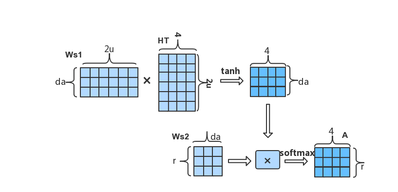

# A Structured Self-attentive Sentence Embedding

After word embedding is applied to the representation of words, natural language processing(NLP) has been effectively improved in many ways. Along with the widespread use of word embedding, many techniques have been developed to express the semantics of sentences by words, such as:
1. The vector representation of multiple words in a sentence is concated or weighted to obtain a vector to represent the sentence.
2. Convolution(CNN) and maximum pooling(MaxPooling) on the matrix of all the word vectors of the sentence, using the final result to represent the semantics of the sentence.
3. Unroll the sentence according to the time step of the word, input the vector representation of each word into a recurrent neural network(RNN), and use the output of the last time step of the RNN as the semantic representation of the sentence.


The above method solves the problem of sentence meaning in a certain extent in many aspects. When concating is used in method one, if the word of the sentence is too long and the vector dimension of the word is slightly larger, then the vector dimension of the sentence will be particularly large, and the internal interaction between the words of the sentence is not taken into account. The use of weighted averaging is not accurate and does not adequately express the impact of each word on sentence semantics. Many useful word meanings may be lost in Method2. The third method selects the output of the last step. If the sentence is too long, the output of the last step does not accurately express the semantics of the sentence.


Based on the above mentioned method, Zhouhan Lin, Minwei Feng et al. published a paper [A Structured Self-attentive Sentence Embedding](https://arxiv.org/pdf/1703.03130.pdf)[1] in 2017, proposed a method based on self-attention structure for sentence embedding and applied to user's reviews classification, textual entailment and other tasks. In the end, good results were obtained.


In this note, we will use [GluonNLP](https://gluon-nlp.mxnet.io/index.html) to reproduce the model structure in A Structured Self-attentive Sentence Embedding and apply it to [Yelp Data's review star rating data set](https://www.yelp.com/dataset/challenge) for classification.

## Import Related Packages

```{.python .input  n=1}
import os
import json
import zipfile
import time
import itertools

import numpy as np 
import mxnet as mx
import multiprocessing as mp
import gluonnlp as nlp

from mxnet import gluon, nd, init
from mxnet.gluon import nn, rnn
from mxnet import autograd, gluon, nd

# iUse sklearn's metric function to evaluate the results of the experiment
from sklearn.metrics import accuracy_score, f1_score

# fixed random number seed
np.random.seed(2018)
mx.random.seed(2018)
```

```{.python .input  n=2}
def try_gpu():
    """If GPU is available, return mx.gpu(0); else return mx.cpu()."""
    try:
        ctx = mx.gpu()
        _ = nd.array([0], ctx=ctx)
    except:
        ctx = mx.cpu()
    return ctx
```

## Data pipeline

### Load The Reviews of Yelp Data

The [user's review data released](https://www.kaggle.com/yelp-dataset/yelp-dataset) by yelp data is json format. The original paper selected 500K data as the training set, 2000 as the validation set, and 2000 as the test set. Due to the limitation of computing power of personal computers and the quick experiment, 200K pieces of data were selected as the training set in this notebook, and 2000 pieces were randomly divided into validation set.
Each sample in the data is a user's comment, the language is English, and each comment category is marked 1-5, representing 5 different emotional colors.

```{.python .input  n=3}
# download the data zip from server.
data_url = 'http://apache-mxnet.s3-accelerate.dualstack.amazonaws.com/gluon/dataset/yelp_review_subset-167bb781.zip'
zip_path = mx.gluon.utils.download(data_url)

# unzip the zip file.
zip_file = zipfile.ZipFile(zip_path)
json_path = zip_file.extract(zip_file.namelist()[0])

## load json data.
with open(json_path, 'r', encoding='utf-8') as fr:
    data = json.load(fr)

# create a list of review a label paris.
dataset = [[text, int(label)] for text, label in zip(data['texts'], data['labels'])]

# randomly divide one percent from the training set as a verification set.
train_dataset, valid_dataset = nlp.data.train_valid_split(dataset, 0.01)
len(train_dataset), len(valid_dataset)
```

### Data Processing

The purpose of the following code is to process the raw data so that the processed data can be used for model training and prediction. We will use the `SpacyTokenizer` to split the comments into strings, `ClipSequence` to crop the comments to the specified length, and build the dictionary based on the word frequency of the training data. Then we attach the [Glove](https://nlp.stanford.edu/pubs/glove.pdf)[2]  pre-trained word vector to the vocab and convert the characters of each comment data into the corresponding word index in the vocab.
Finally get the standardized training data set and verification data set

```{.python .input  n=4}
# tokenizer takes as input a string and outputs a list of tokens.
tokenizer = nlp.data.SpacyTokenizer('en')

# length_clip takes as input a list and outputs a list with maximum length 100.
length_clip = nlp.data.ClipSequence(100)

def preprocess(x):
    
    # Limit the range of labels to 0-4
    data, label = x[0], x[1]-1
    
    # clip the length of review words
    data = length_clip(tokenizer(data))
    return data, label

def get_length(x):
    return float(len(x[0]))

def preprocess_dataset(dataset):
    start = time.time()
    
    with mp.Pool() as pool:
        # Each sample is processed in an asynchronous manner.
        dataset = gluon.data.SimpleDataset(pool.map(preprocess, dataset))
        lengths = gluon.data.SimpleDataset(pool.map(get_length, dataset))
    end = time.time()
    
    print('Done! Tokenizing Time={:.2f}s, #Sentences={}'.format(end - start, len(dataset)))
    return dataset, lengths

# Preprocess the dataset
train_dataset, train_data_lengths = preprocess_dataset(train_dataset)
valid_dataset, valid_data_lengths = preprocess_dataset(valid_dataset)
```

```{.python .input  n=5}
# create vocab
train_seqs = [sample[0] for sample in train_dataset]
counter = nlp.data.count_tokens(list(itertools.chain.from_iterable(train_seqs)))

vocab = nlp.Vocab(counter, max_size=10000, padding_token=None, bos_token=None, eos_token=None)
 
# load pre-trained embedding,Glove
embedding_weights = nlp.embedding.GloVe(source='glove.6B.300d')
vocab.set_embedding(embedding_weights)
print(vocab)

def token_to_idx(x):
    return vocab[x[0]], x[1]

# A token index or a list of token indices is returned according to the vocabulary.
with mp.Pool() as pool:
    train_dataset = pool.map(token_to_idx, train_dataset)
    valid_dataset = pool.map(token_to_idx, valid_dataset)
    
```

## Bucketing and DataLoader
Since each sentence may have a different length, we need to use `Pad` to fill the sentences in a minibatch to equal lengths so that the data can be quickly tensored on the GPU. At the same time, we need to use `Stack` to stack the category tags of a batch of data. For convenience, we use `Tuple` to combine `Pad` and `Stack`.

In order to make the length of the sentence pad in each minibatch as small as possible, we should make the sentences with similar lengths in a batch as much as possible. In light of this, we consider constructing a sampler using `FixedBucketSampler`, which defines how the samples in a dataset will be iterated in a more economic way.

Finally, we use `DataLoader` to build a data loader for the training. dataset and validation dataset. The training dataset requires FixedBucketSampler, but the validation dataset dosen't require the sampler.

```{.python .input  n=6}
batch_size = 64
bucket_num = 10
bucket_ratio = 0.5


def get_dataloader():
    # Construct the DataLoader Pad data, stack label and lengths
    batchify_fn = nlp.data.batchify.Tuple(
        nlp.data.batchify.Pad(axis=0),
        nlp.data.batchify.Stack())
    
    # n this example, we use a FixedBucketSampler, 
    # which assigns each data sample to a fixed bucket based on its length. 
    batch_sampler = nlp.data.sampler.FixedBucketSampler(
        train_data_lengths,
        batch_size=batch_size,
        num_buckets=bucket_num,
        ratio=bucket_ratio,
        shuffle=True)
    print(batch_sampler.stats())
    
    # train_dataloader
    train_dataloader = gluon.data.DataLoader(
        dataset=train_dataset,
        batch_sampler=batch_sampler,
        batchify_fn=batchify_fn)
    # valid_dataloader
    valid_dataloader = gluon.data.DataLoader(
        dataset=valid_dataset,
        batch_size=batch_size,
        shuffle=False,
        batchify_fn=batchify_fn)
    return train_dataloader, valid_dataloader

train_dataloader, valid_dataloader = get_dataloader()
```

## Model Structure

In the original paper, the representation of the sentence is: firstly, the sentence is disassembled into a list corresponding to the word, then the words are unrolled in order, and the word vector of each word is calculated as the input of each step of the [bidirectional LSTM neural network layer](https://www.bioinf.jku.at/publications/older/2604.pdf)[3]. Taking the output of each step of the bidirectional LSTM network layer, a matrix H is obtained. Suppose the hidden_dim of the bidirectional LSTM is `u`, the word length of the sentence is `n`, then the dimension of the last H is `n-by-2u`. For example, the sentence :this movie is amazing.


Attention is similar to when humans look at things, we always give different importance to what we see in the perspective of the eye. For example, when we are communicating with people, our eyes will always pay more attention to the face of the communicator, not to the edge of other perspectives. So when we want to express the sentence, we can pay different attention to the output H of the bidirectional LSTM layer.

$$
A = Softmax(W_{s2}tanh(W_{s1}H^T)) 
$$

Here, W<sub>s1</sub> is a weight matrix with the shape: d<sub>a</sub>-by-2u, where d<sub>a</sub> is a hyperparameter.
W<sub>s2</sub> is a weight matrix with the shape: r-by-d<sub>a</sub>, where r is the number of different attentions you want to use.

When the attention matrix A and the output H of the LSTM are obtained, the final representation is obtained by M=AH.


We can first customize a layer of attention, specify the number of hidden nodes att_unit and the number of attention channels att_hops.

```{.python .input  n=7}
# custom attention layer
class SelfAttention(nn.HybridBlock):
    def __init__(self, att_unit, att_hops, **kwargs):
        super(SelfAttention, self).__init__(**kwargs)
        with self.name_scope():
            self.ut_dense = nn.Dense(att_unit, activation='tanh', flatten=False)
            self.et_dense = nn.Dense(att_hops, activation=None, flatten=False)

    def hybrid_forward(self, F, x):
        # x shape: [batch_size, seq_len, embedding_width]
        # ut shape: [batch_size, seq_len, att_unit]
        ut = self.ut_dense(x)
        # et shape: [batch_size, seq_len, att_hops]
        et = self.et_dense(ut)

        # att shape: [batch_size,  att_hops, seq_len]
        att = F.softmax(F.transpose(et, axes=(0, 2, 1)), axis=-1)
        # output shape [batch_size, att_hops, embedding_width]
        output = F.batch_dot(att, x)

        return output, att
```

Sometimes the number of samples in different categories of data is very unbalanced, which can be balanced by applying different weights to the losses of different categories of samples. Here we customize a SoftmaxCrossEntroy layer that accepts the category weight parameters and resolves the effects of data imbalance.

```{.python .input  n=8}
   
class WeightedSoftmaxCE(nn.HybridBlock):
    def __init__(self, sparse_label=True, from_logits=False,  **kwargs):
        super(WeightedSoftmaxCE, self).__init__(**kwargs)
        with self.name_scope():
            self.sparse_label = sparse_label
            self.from_logits = from_logits

    def hybrid_forward(self, F, pred, label, class_weight, depth=None):
        if self.sparse_label:
            label = F.reshape(label, shape=(-1, ))
            label = F.one_hot(label, depth)
        if not self.from_logits:
            pred = F.log_softmax(pred, -1)

        weight_label = F.broadcast_mul(label, class_weight)
        loss = -F.sum(pred * weight_label, axis=-1)

        # return F.mean(loss, axis=0, exclude=True)
        return loss
    
```

```{.python .input  n=9}
# model
class SelfAttentiveBiLSTM(nn.HybridBlock):
    def __init__(self, vocab_len, emsize, nhide, nlayers, att_unit, att_hops, nfc, nclass,
                 drop_prob, pool_way, prune_p=None, prune_q=None, **kwargs):
        super(SelfAttentiveBiLSTM, self).__init__(**kwargs)
        with self.name_scope():
            self.embedding_layer = nn.Embedding(vocab_len, emsize)
            self.bilstm = rnn.LSTM(nhide, num_layers=nlayers, dropout=drop_prob, bidirectional=True)
            self.att_encoder = SelfAttention(att_unit, att_hops)
            self.dense = nn.Dense(nfc, activation='tanh')
            self.output_layer = nn.Dense(nclass)

            self.dense_p, self.dense_q = None, None
            if all([prune_p, prune_q]):
                self.dense_p = nn.Dense(prune_p, activation='tanh', flatten=False)
                self.dense_q = nn.Dense(prune_q, activation='tanh', flatten=False)

            self.drop_prob = drop_prob
            self.pool_way = pool_way

    def hybrid_forward(self, F, inp):
        # input_embed: [batch, len, emsize]
        inp_embed = self.embedding_layer(inp)
        h_output = self.bilstm(F.transpose(inp_embed, axes=(1, 0, 2)))
        # att_output: [batch, att_hops, emsize]
        att_output, att = self.att_encoder(F.transpose(h_output, axes=(1, 0, 2)))

        dense_input = None
        if self.pool_way == 'flatten':
            dense_input = F.Dropout(F.flatten(att_output), self.drop_prob)
        elif self.pool_way == 'mean':
            dense_input = F.Dropout(F.mean(att_output, axis=1), self.drop_prob)
        elif self.pool_way == 'prune' and all([self.dense_p, self.dense_q]):
            # p_section: [batch, att_hops, prune_p]
            p_section = self.dense_p(att_output)
            # q_section: [batch, emsize, prune_q]
            q_section = self.dense_q(F.transpose(att_output, axes=(0, 2, 1)))
            dense_input = F.Dropout(F.concat(F.flatten(p_section), F.flatten(q_section), dim=-1), self.drop_prob)

        dense_out = self.dense(dense_input)
        output = self.output_layer(F.Dropout(dense_out, self.drop_prob))

        return output, att
```

## Configure parameters and build models

The resulting `M` is a matrix, and the way to classify this matrix is `flatten`, `mean` or `prune`. Prune is a way of trimming parameters proposed in the original paper and has been implemented here.

```{.python .input  n=10}
vocab_len = len(vocab)
emsize = 300    # word embedding size
nhide = 300    # lstm hidden_dim
nlayers = 2     # lstm layers
att_unit = 350     # the hidden_units of attenion layer
att_hops = 2    # the channels of attention
nfc = 512
nclass = 5

drop_prob = 0.5
pool_way = 'flatten'    # # The way to handle M
prune_p = None
prune_q = None

ctx = try_gpu()

model = SelfAttentiveBiLSTM(vocab_len, emsize, nhide, nlayers, 
                            att_unit, att_hops, nfc, nclass,
                            drop_prob, pool_way, prune_p, prune_q)

model.initialize(init=init.Xavier(), ctx=ctx)
model.hybridize()

# Attach a pre-trained glove word vector to the embedding layer
model.embedding_layer.weight.set_data(vocab.embedding.idx_to_vec)
# fixed the layer
model.embedding_layer.collect_params().setattr('grad_req', 'null')
```

Using r attention can improve the representation of sentences with different semantics, but if the value of each line in the attention matrix A (r-byn) is very close, that is, there is no difference between several attentions. In the subsequent M = AH, the resulting M will contain a lot of redundant information.
So in order to solve this problem, we should try to force A to ensure that the value of each line has obvious differences, that is, try to satisfy the diversity of attention. Therefore, a penalty can be used to achieve this goal.
$$ P = ||(AA^T-I)||_F^2 $$


It can be seen from the above formula that if the value of each row of A is more similar, the result of P will be larger, and the value of A is less similar for each row, and P is smaller. This means that when the r-focused diversity of A is larger, the smaller P is. So by including this penalty item with the Loss of the model, you can try to ensure the diversity of A.

```{.python .input  n=11}
def evaluate(data_iter_valid, model, loss, ctx, penal_coeff=0.0, class_weight=None, loss_name='wsce'):
    valid_loss = 0.
    total_pred = []
    total_true = []
    n_batch = 0
    for batch_x, batch_y in data_iter_valid:
        batch_x = batch_x.as_in_context(ctx)
        batch_y = batch_y.as_in_context(ctx)
        batch_pred, att = model(batch_x)
        if loss_name == 'sce':
            l = loss(batch_pred, batch_y)
        elif loss_name == 'wsce':
            l = loss(batch_pred, batch_y, class_weight, class_weight.shape[0])
        
        # penalty
        temp = nd.batch_dot(att, nd.transpose(att, axes=(0, 2, 1))
                            ) - nd.eye(att.shape[1], ctx=att.context)
        l = l + penal_coeff * temp.norm(axis=(1, 2))
        total_pred.extend(np.argmax(nd.softmax(batch_pred, axis=1).asnumpy(), axis=1).tolist())
        total_true.extend(np.reshape(batch_y.asnumpy(), (-1,)).tolist())
        n_batch += 1
        valid_loss += l.mean().asscalar()

    F1_valid = f1_score(np.array(total_true), np.array(total_pred), average='weighted')
    acc_valid = accuracy_score(np.array(total_true), np.array(total_pred))
    valid_loss /= n_batch

    return F1_valid, acc_valid, valid_loss
```

```{.python .input  n=12}

def train(data_iter_train, data_iter_valid, model, loss, trainer, 
          ctx, num_epochs, penal_coeff=0.0, clip=None,
          class_weight=None, loss_name='wsce'):
    
    print('Train on ', ctx)
    for epoch in range(1, num_epochs + 1):
        start = time.time()
        train_loss = 0.
        total_pred = []
        total_true = []
        n_batch = 0

        for batch_x, batch_y in data_iter_train:
            batch_x = batch_x.as_in_context(ctx)
            batch_y = batch_y.as_in_context(ctx)
            with autograd.record():
                batch_pred, att = model(batch_x)
                if loss_name == 'sce':
                    l = loss(batch_pred, batch_y)
                elif loss_name == 'wsce':
                    l = loss(batch_pred, batch_y, class_weight, class_weight.shape[0])

                # penalty
                temp = nd.batch_dot(att, nd.transpose(att, axes=(0, 2, 1))
                                   ) - nd.eye(att.shape[1], ctx=ctx)
                l = l + penal_coeff * temp.norm(axis=(1, 2))
            
            # backward calculate
            l.backward()

            # clip gradient
            clip_params = [p.data() for p in model.collect_params().values()]
            if clip is not None:
                norm = nd.array([0.0], ctx)
                for param in clip_params:
                    if param.grad is not None:
                        norm += (param.grad ** 2).sum()
                norm = norm.sqrt().asscalar()
                if norm > clip:
                    for param in clip_params:
                        if param.grad is not None:
                            param.grad[:] *= clip / norm

            # update parmas
            trainer.step(batch_x.shape[0])
            
            # keep result for metric
            batch_pred = np.argmax(nd.softmax(batch_pred, axis=1).asnumpy(), axis=1)
            batch_true = np.reshape(batch_y.asnumpy(), (-1, ))
            total_pred.extend(batch_pred.tolist())
            total_true.extend(batch_true.tolist())
            batch_train_loss = l.mean().asscalar()

            n_batch += 1
            train_loss += batch_train_loss

            if n_batch % 400 == 0:
                print('epoch %d, batch %d, batch_train_loss %.4f, batch_train_acc %.3f' %
                      (epoch, n_batch, batch_train_loss, accuracy_score(batch_true, batch_pred)))
        
        # metric
        F1_train = f1_score(np.array(total_true), np.array(total_pred), average='weighted')
        acc_train = accuracy_score(np.array(total_true), np.array(total_pred))
        train_loss /= n_batch
        
        # evaluate on valid_data
        F1_valid, acc_valid, valid_loss = evaluate(data_iter_valid, model, loss, ctx,
                                                   penal_coeff, class_weight, loss_name)

        print('epoch %d, learning_rate %.5f \n\t train_loss %.4f, acc_train %.3f, F1_train %.3f, ' %
              (epoch, trainer.learning_rate, train_loss, acc_train, F1_train))
        print('\t valid_loss %.4f, acc_valid %.3f, F1_valid %.3f, '
              '\ntime %.1f sec' % (valid_loss, acc_valid, F1_valid, time.time() - start))
        print('='*50)

        # declay lr
        if epoch % 2 == 0:
            trainer.set_learning_rate(trainer.learning_rate * 0.9)
```

## Train
Now that we are training the model, we use WeightedSoftmaxCE to alleviate the problem of data category imbalance. We performed statistical analysis on the data in advance to get a set of class_weight.

```{.python .input  n=13}
class_weight = None
loss_name = 'wsce'
optim = 'adam'
lr = 0.001
penal_coeff = 0.1
clip = 0.5
nepochs = 4

trainer = gluon.Trainer(model.collect_params(), optim, {'learning_rate': lr})

if loss_name == 'sce':
    loss = gluon.loss.SoftmaxCrossEntropyLoss()
elif loss_name == 'wsce':
    loss = WeightedSoftmaxCE()
    class_weight = nd.array([3.0, 5.3, 4.0, 2.0, 1.0], ctx=ctx)
```

```{.python .input  n=14}
train(train_dataloader, valid_dataloader, model, loss, 
      trainer, ctx, nepochs, penal_coeff=penal_coeff, 
      clip=clip, class_weight=class_weight, loss_name=loss_name)
```

## Predict
Now we will randomly input a sentence into the model and predict its emotional value tag. The range of emotional markers is 1-5, which corresponds to the degree of negative to positive.

```{.python .input  n=15}
input_ar = nd.array(vocab[['This', 'movie', 'is', 'amazing']], ctx=ctx).reshape((1, -1))
pred, att = model(input_ar)

label = np.argmax(nd.softmax(pred, axis=1).asnumpy(), axis=1) + 1
print(label)
print(att)
```

In order to intuitively feel the role of the attention mechanism, we visualize the output of the model's attention on the predicted samples.

```{.python .input  n=16}
import matplotlib.pyplot as plt
import seaborn as sns
%matplotlib inline

np.squeeze(att.asnumpy(), 0).shape
plt.figure(figsize=(8,1))
cmap = sns.diverging_palette(220, 10, as_cmap=True)
sns.heatmap(np.squeeze(att.asnumpy(), 0), cmap=cmap, annot=True,
            xticklabels=['This', 'movie', 'is', 'amazing'], yticklabels=['att0', 'att1'])
plt.show()
```

## Save Model

```{.python .input  n=17}
model_dir = './models'
if not os.path.exists(model_dir):
    os.makedirs(model_dir)
model_path = os.path.join(model_dir, 'self_att_bilstm_model')
model.export(model_path)
print('the structure and params of model have saved in：', model_path)

```

## Conclusion
Word embedding can effectively represent the semantic similarity between words, which brings many breakthroughs for complex natural language processing tasks. The attention mechanism can intuitively grasp the important semantic features in the sentence. The LSTM captures the word order relationship between words in a sentence. Through word embedding, LSTM and attention mechanisms work together to effectively represent the semantics of a sentence and apply it to many practical tasks.

GluonNLP provides us with many efficient and convenient tools to help us experiment quickly. This greatly simplifies the tedious work of natural language processing.

## Reference
1. [A Structured Self-Attentive Sentence Embedding](https://arxiv.org/pdf/1703.03130.pdf)
2. [Glove: Global vectors for word representation. In Proceedings of the 2014 conference on empirical methods in natural language processing](https://nlp.stanford.edu/pubs/glove.pdf)
3. [Long short-term memory](https://www.bioinf.jku.at/publications/older/2604.pdf)
