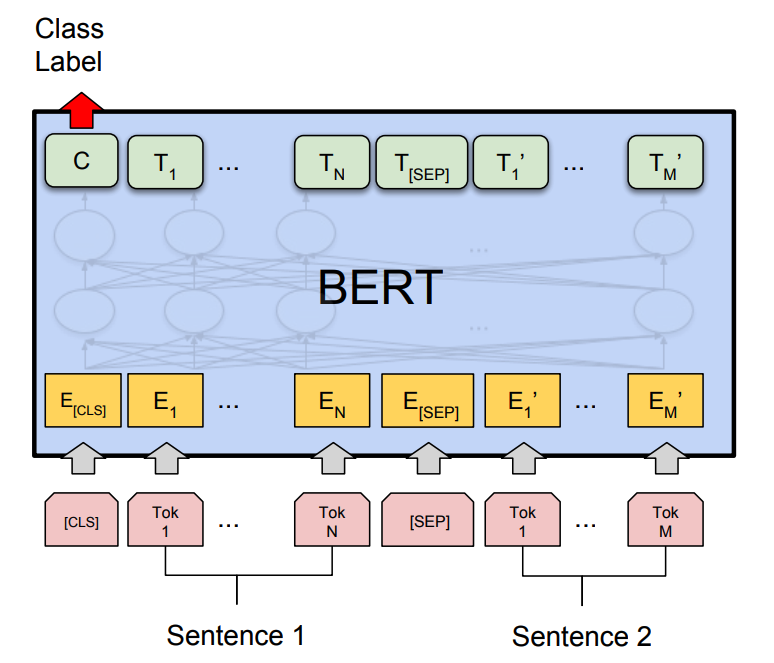
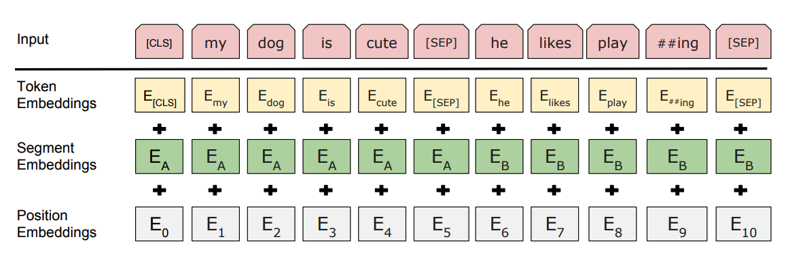

# Fine-tuning Sentence Pair Classification with BERT

Pre-trained language representations have been shown to improve many downstream NLP tasks such as
question answering, and natural language inference. To apply pre-trained
representations to these tasks, there are two main strategies:

1. The *feature-based* approach, which uses the pre-trained representations as additional
features to the downstream task.
2. Or the *fine-tuning*-based approach, which trains the downstream tasks by
fine-tuning pre-trained parameters.

While feature-based approaches such as ELMo [3] (introduced in the previous tutorial) are effective
in improving many downstream tasks, they require task-specific architectures.
Devlin, Jacob, et al proposed BERT [1] (Bidirectional Encoder Representations
from Transformers), which *fine-tunes* deep bi-directional representations on a
wide range of tasks with minimal task-specific parameters, and obtains state-
of-the-art results.

In this tutorial, we will focus on fine-tuning with the
pre-trained BERT model to classify semantically equivalent sentence pairs.

Specifically, we will:

1. Load the state-of-the-art pre-trained BERT model and attach an additional layer for classification
2. Process and transform sentence-pair data for the task at hand
3. Fine-tune the BERT model for sentence classification

## Setup

To use this tutorial, please download the required files from the above download link, and install
GluonNLP.

### Importing necessary modules

```{.python .input}
import warnings
warnings.filterwarnings('ignore')

import io
import random
import numpy as np
import mxnet as mx
import gluonnlp as nlp
from gluonnlp.calibration import BertLayerCollector
# this notebook assumes that all required scripts are already
# downloaded from the corresponding tutorial webpage on http://gluon-nlp.mxnet.io
from bert import data

nlp.utils.check_version('0.8.1')
```

### Setting up the environment

Please note the comment in the code if no GPU is available.

```{.python .input}
np.random.seed(100)
random.seed(100)
mx.random.seed(10000)
# change `ctx` to `mx.cpu()` if no GPU is available.
ctx = mx.gpu(0)
```

## Using the pre-trained BERT model

The list of pre-trained BERT models available
in GluonNLP can be found
[here](../../model_zoo/bert/index.rst).

In this
tutorial, the BERT model we will use is BERT
BASE trained on an uncased corpus of books and
the English Wikipedia dataset in the
GluonNLP model zoo.

### Get BERT

Let's first take
a look at the BERT model
architecture for sentence pair classification below:
<div style="width:
500px;"></div>
where the model takes a pair of
sequences and pools the representation of the
first token in the sequence.
Note that the original BERT model was trained for a
masked language model and next-sentence prediction tasks, which includes layers
for language model decoding and
classification. These layers will not be used
for fine-tuning the sentence pair classification.

We can load the
pre-trained BERT fairly easily
using the model API in GluonNLP, which returns the vocabulary
along with the
model. We include the pooler layer of the pre-trained model by setting
`use_pooler` to `True`.

```{.python .input}
bert_base, vocabulary = nlp.model.get_model('bert_12_768_12',
                                             dataset_name='book_corpus_wiki_en_uncased',
                                             pretrained=True, ctx=ctx, use_pooler=True,
                                             use_decoder=False, use_classifier=False)
print(bert_base)
```

### Transform the model for `SentencePair` classification

Now that we have loaded
the BERT model, we only need to attach an additional layer for classification.
The `BERTClassifier` class uses a BERT base model to encode sentence
representation, followed by a `nn.Dense` layer for classification.

```{.python .input}
bert_classifier = nlp.model.BERTClassifier(bert_base, num_classes=2, dropout=0.1)
# only need to initialize the classifier layer.
bert_classifier.classifier.initialize(init=mx.init.Normal(0.02), ctx=ctx)
bert_classifier.hybridize(static_alloc=True)

# softmax cross entropy loss for classification
loss_function = mx.gluon.loss.SoftmaxCELoss()
loss_function.hybridize(static_alloc=True)

metric = mx.metric.Accuracy()
```

## Data preprocessing for BERT

For this tutorial, we need to do a bit of preprocessing before feeding our data introduced
the BERT model. Here we want to leverage the dataset included in the downloaded archive at the
beginning of this tutorial.

### Loading the dataset

We use
the dev set of the
Microsoft Research Paraphrase Corpus dataset. The file is
named 'dev.tsv'. Let's take a look at the first few lines of the raw dataset.

```{.python .input}
tsv_file = io.open('dev.tsv', encoding='utf-8')
for i in range(5):
    print(tsv_file.readline())
```

The file contains 5 columns, separated by tabs.
The header of
the file explains each of these columns, although an explanation for each is included
here:
0. The label indicating whether the two
sentences are semantically equivalent
1. The id of the first sentence in this
sample
2. The id of the second sentence in this sample
3. The content of the
first sentence
4. The content of the second sentence

For our task, we are
interested in the 0th, 3rd and 4th columns.
To load this dataset, we can use the
`TSVDataset` API and skip the first line because it's just the schema:

```{.python .input}
# Skip the first line, which is the schema
num_discard_samples = 1
# Split fields by tabs
field_separator = nlp.data.Splitter('\t')
# Fields to select from the file
field_indices = [3, 4, 0]
data_train_raw = nlp.data.TSVDataset(filename='dev.tsv',
                                 field_separator=field_separator,
                                 num_discard_samples=num_discard_samples,
                                 field_indices=field_indices)
sample_id = 0
# Sentence A
print(data_train_raw[sample_id][0])
# Sentence B
print(data_train_raw[sample_id][1])
# 1 means equivalent, 0 means not equivalent
print(data_train_raw[sample_id][2])
```

To use the pre-trained BERT model, we need to pre-process the data in the same
way it was trained. The following figure shows the input representation in BERT:
<div style="width: 500px;"></div>

We will use
`BERTDatasetTransform` to perform the following transformations:
- tokenize
the
input sequences
- insert [CLS] at the beginning
- insert [SEP] between sentence
A and sentence B, and at the end
- generate segment ids to indicate whether
a token belongs to the first sequence or the second sequence.
- generate valid length

```{.python .input}
# Use the vocabulary from pre-trained model for tokenization
bert_tokenizer = nlp.data.BERTTokenizer(vocabulary, lower=True)

# The maximum length of an input sequence
max_len = 128

# The labels for the two classes [(0 = not similar) or  (1 = similar)]
all_labels = ["0", "1"]

# whether to transform the data as sentence pairs.
# for single sentence classification, set pair=False
# for regression task, set class_labels=None
# for inference without label available, set has_label=False
pair = True
transform = data.transform.BERTDatasetTransform(bert_tokenizer, max_len,
                                                class_labels=all_labels,
                                                has_label=True,
                                                pad=True,
                                                pair=pair)
data_train = data_train_raw.transform(transform)

print('vocabulary used for tokenization = \n%s'%vocabulary)
print('%s token id = %s'%(vocabulary.padding_token, vocabulary[vocabulary.padding_token]))
print('%s token id = %s'%(vocabulary.cls_token, vocabulary[vocabulary.cls_token]))
print('%s token id = %s'%(vocabulary.sep_token, vocabulary[vocabulary.sep_token]))
print('token ids = \n%s'%data_train[sample_id][0])
print('segment ids = \n%s'%data_train[sample_id][1])
print('valid length = \n%s'%data_train[sample_id][2])
print('label = \n%s'%data_train[sample_id][3])
```

## Fine-tuning the model

Now we have all the pieces to put together, and we can finally start fine-tuning the
model with very few epochs. For demonstration, we use a fixed learning rate and
skip the validation steps. For the optimizer, we leverage the ADAM optimizer which
performs very well for NLP data and for BERT models in particular.

```{.python .input}
# The hyperparameters
batch_size = 32
lr = 5e-6

# The FixedBucketSampler and the DataLoader for making the mini-batches
train_sampler = nlp.data.FixedBucketSampler(lengths=[int(item[2]) for item in data_train],
                                            batch_size=batch_size,
                                            shuffle=True)
bert_dataloader = mx.gluon.data.DataLoader(data_train, batch_sampler=train_sampler)

trainer = mx.gluon.Trainer(bert_classifier.collect_params(), 'adam',
                           {'learning_rate': lr, 'epsilon': 1e-9})

# Collect all differentiable parameters
# `grad_req == 'null'` indicates no gradients are calculated (e.g. constant parameters)
# The gradients for these params are clipped later
params = [p for p in bert_classifier.collect_params().values() if p.grad_req != 'null']
grad_clip = 1

# Training the model with only three epochs
log_interval = 4
num_epochs = 3
for epoch_id in range(num_epochs):
    metric.reset()
    step_loss = 0
    for batch_id, (token_ids, segment_ids, valid_length, label) in enumerate(bert_dataloader):
        with mx.autograd.record():

            # Load the data to the GPU
            token_ids = token_ids.as_in_context(ctx)
            valid_length = valid_length.as_in_context(ctx)
            segment_ids = segment_ids.as_in_context(ctx)
            label = label.as_in_context(ctx)

            # Forward computation
            out = bert_classifier(token_ids, segment_ids, valid_length.astype('float32'))
            ls = loss_function(out, label).mean()

        # And backwards computation
        ls.backward()

        # Gradient clipping
        trainer.allreduce_grads()
        nlp.utils.clip_grad_global_norm(params, 1)
        trainer.update(1)

        step_loss += ls.asscalar()
        metric.update([label], [out])

        # Printing vital information
        if (batch_id + 1) % (log_interval) == 0:
            print('[Epoch {} Batch {}/{}] loss={:.4f}, lr={:.7f}, acc={:.3f}'
                         .format(epoch_id, batch_id + 1, len(bert_dataloader),
                                 step_loss / log_interval,
                                 trainer.learning_rate, metric.get()[1]))
            step_loss = 0
```

## Quantize the model

GluonNLP also delivered some INT8 quantization methods to improve the performance and reduce the deployment costs for the natural language inference tasks. In real production, there are two main benefits of lower precision (INT8). First, the computation can be accelerated by the low precision instruction, like Intel Vector Neural Network Instruction (VNNI). Second, lower precision data type would save the memory bandwidth and allow for better cache locality and save the power. The new feature can get up to 4X performance speedup in the latest [AWS EC2 C5 instances](https://aws.amazon.com/blogs/aws/now-available-new-c5-instance-sizes-and-bare-metal-instances/) under the [Intel Deep Learning Boost (VNNI)](https://www.intel.ai/intel-deep-learning-boost/) enabled hardware with less than 0.5% accuracy drop.

Now we have a fine-tuned model on MRPC training dataset and in this section, we will quantize the model into INT8 data type on a subset of MRPC validation dataset.

```{.python .input}
# The hyperparameters
dev_batch_size = 32
num_calib_batches = 5
quantized_dtype = 'auto'
calib_mode = 'customize'

# sampler for evaluation
pad_val = vocabulary[vocabulary.padding_token]
batchify_fn = nlp.data.batchify.Tuple(
    nlp.data.batchify.Pad(axis=0, pad_val=pad_val),  # input
    nlp.data.batchify.Pad(axis=0, pad_val=0),  # segment
    nlp.data.batchify.Stack(),  # length
    nlp.data.batchify.Stack('int32'))  # label
dev_dataloader = mx.gluon.data.DataLoader(data_train, batch_size=dev_batch_size, num_workers=4,
                                           shuffle=False, batchify_fn=batchify_fn)

# Calibration function
def calibration(net, dev_data, num_calib_batches, quantized_dtype, calib_mode):
    """calibration function on the dev dataset."""
    print('Now we are doing calibration on dev with cpu.')
    collector = BertLayerCollector(clip_min=-50, clip_max=10, logger=None)
    num_calib_examples = dev_batch_size * num_calib_batches
    quantized_net = mx.contrib.quantization.quantize_net_v2(net, quantized_dtype=quantized_dtype,
                                                            exclude_layers=[],
                                                            quantize_mode='smart',
                                                            quantize_granularity='channel-wise',
                                                            calib_data=dev_data,
                                                            calib_mode=calib_mode,
                                                            num_calib_examples=num_calib_examples,
                                                            ctx=mx.cpu(),
                                                            LayerOutputCollector=collector,
                                                            logger=None)
    print('Calibration done with success.')
    return quantized_net

# will remove until mxnet 1.7 release.
try:
    quantized_net = calibration(bert_classifier,
                                dev_dataloader,
                                num_calib_batches,
                                quantized_dtype,
                                calib_mode)
except AttributeError:
    nlp.utils.version.check_version('1.7.0', warning_only=True, library=mx)
    warnings.warn('INT8 Quantization for BERT need mxnet-mkl >= 1.6.0b20200115')
```

## Deployment

After quantization, we can also export the quantized model for inference deployment.

```{.python .input}
prefix = './model_bert_squad_quantized'

def deployment(net, prefix, dataloader):
    net.export(prefix, epoch=0)
    print('Saving quantized model at ', prefix)
    print('load symbol file directly as SymbolBlock for model deployment.')
    static_net = mx.gluon.SymbolBlock.imports('{}-symbol.json'.format(prefix), 
                                    ['data0', 'data1', 'data2'],
                                    '{}-0000.params'.format(prefix))
    static_net.hybridize(static_alloc=True, static_shape=True)
    for batch_id, (token_ids, segment_ids, valid_length, label) in enumerate(dev_dataloader):
            token_ids = token_ids.as_in_context(mx.cpu())
            valid_length = valid_length.as_in_context(mx.cpu())
            segment_ids = segment_ids.as_in_context(mx.cpu())
            label = label.as_in_context(mx.cpu())
            out = static_net(token_ids, segment_ids, valid_length.astype('float32'))
            metric.update([label], [out])

            # Printing vital information
            if (batch_id + 1) % (log_interval) == 0:
                print('[Batch {}/{}], acc={:.3f}'
                            .format(batch_id + 1, len(bert_dataloader),
                                    metric.get()[1]))
    return metric

# will remove until mxnet 1.7 release.
try:
    eval_metric = deployment(quantized_net, prefix, dev_dataloader)
except NameError:
    nlp.utils.version.check_version('1.7.0', warning_only=True, library=mx)
    warnings.warn('INT8 Quantization for BERT need mxnet-mkl >= 1.6.0b20200115')
```

## Conclusion

In this tutorial, we showed how to fine-tune a sentence pair
classification model with pre-trained BERT parameters. In GluonNLP, this can be
done with such few, simple steps. All we did was apply a BERT-style data transformation to
pre-process the data, automatically download the pre-trained model, and feed the
transformed data into the model, all within 50 lines of code!

For demonstration purpose, we skipped the warmup learning rate
schedule and validation on the dev dataset used in the original
implementation. Please visit the
[BERT model zoo webpage](../../model_zoo/bert/index.rst), or the scripts/bert folder
in the Github repository for the complete fine-tuning scripts.

## References

[1] Devlin, Jacob, et al. "Bert:
Pre-training of deep
bidirectional transformers for language understanding."
arXiv preprint
arXiv:1810.04805 (2018).

[2] Dolan, William B., and Chris
Brockett.
"Automatically constructing a corpus of sentential paraphrases."
Proceedings of
the Third International Workshop on Paraphrasing (IWP2005). 2005.

[3] Peters,
Matthew E., et al. "Deep contextualized word representations." arXiv
preprint
arXiv:1802.05365 (2018).
