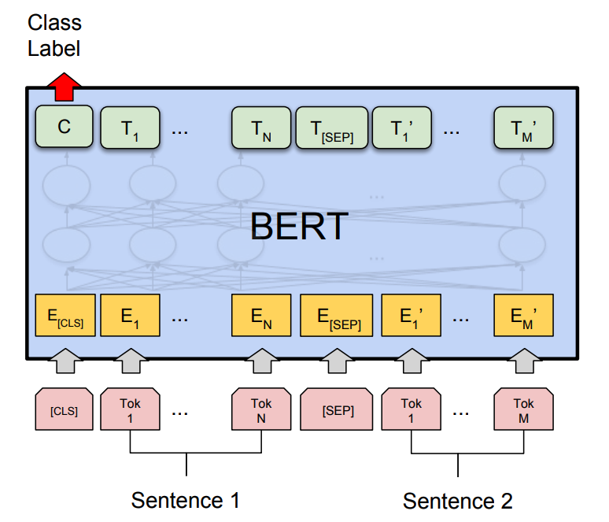
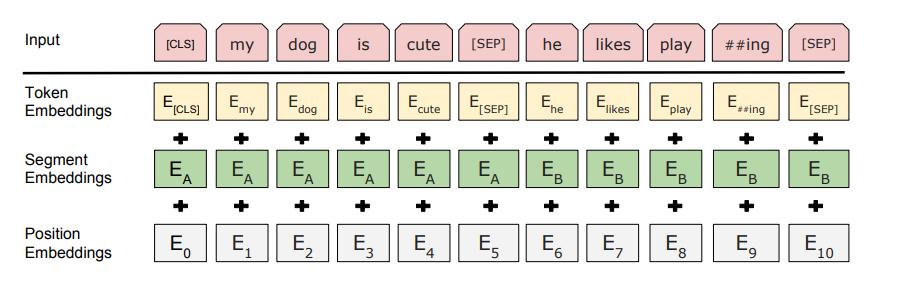

# Sentiment Analysis with KoBERT using Movie Review Data
# KoBERT를 이용한 네이버 영화 리뷰 감정 분석

In this tutorial, we will implement a sentiment analysis of [Naver sentiment
movie corpus](https://github.com/e9t/nsmc) with a pretrained Korean BERT
(**KoBERT**) provided by GluonNLP's Model Zoo.

이번 예제에서는 GluonNLP의 Model Zoo에서 제공하는 한국어 BERT(**KoBERT**)의 pretrained 모델로 네이버
영화리뷰의 감정 분석(sentiment analysis)을 구현해 보겠습니다.

## Setup
## 사전 설치

If you have a package listed below but not installed yet, uncomment the line and
install the file.

아래 나열된 패키지 중에서 아직 설치되지 않은 것이 있다면, 커멘드 기호('#')를 제거하고 파일을 설치합니다.

```{.python .input}
#!pip install tqdm
#!pip install mxnet-cu101
#!pip install gluonnlp 
#!pip install sentencepiece
```

```{.python .input}
import numpy as np
from mxnet.gluon import nn, rnn
from mxnet import gluon, autograd
import gluonnlp as nlp
from mxnet import nd 
import mxnet as mx
import time
import itertools
import random
```

## Load KoBERT Model
## KoBERT 모델 로드

Load the pre-trained KoBERT model from GluonNLP's Model Zoo.

사전학습한 KoBERT 모델을 GluonNLP의 Model Zoo에서 로드합니다.

```{.python .input}
ctx = mx.gpu()
```

```{.python .input}
bert_base, vocab = nlp.model.bert.get_bert_model('bert_12_768_12', 'kobert_news_wiki_ko_cased', pretrained=True, use_pooler=False, use_decoder=False, use_classifier=False, ctx=ctx)
```

```{.python .input}
tokenizer = nlp.data.get_tokenizer('bert_12_768_12', 'kobert_news_wiki_ko_cased')
tok = nlp.data.BERTSPTokenizer(tokenizer._path, vocab, lower=False)
```

## Define Classifier
## Classifier 정의

Now define the `BERTClassifier` class to classify the positive or negative
reviews.
The last pooling layer (`pooler`) of the BERT model returns the embedding vector
of the `[CLS]` token.
You can simply configure `BERTClassifier` by linking this output to a fully
connected layer (`nn.Dense`) and softmax layer.
The Softmax output is the probability value of the positive/negative label, and
you can compare the predicted label with the ground truth label to calculate the
cross-entropy and update the model in a direction that minimizes the loss.

이제 영화 리뷰의 긍정/부정을 분류할 `BERTClassifier` 클래스를 정의합니다.
BERT 모델 마지막의 pooling layer (`pooler`)는 `[CLS]` 토큰의 임베딩 벡터를 리턴하는데,
이 출력을 fully connected layer (`nn.Dense`)와 softmax layer로 연결해 간단하게
`BERTClassifier`를 구성할 수 있습니다.
Softmax 출력은 긍정/부정 레이블의 확률 값이 되며, 예측한 레이블을 ground truth 레이블과 비교해 크로스 엔트로피를 계산하고
손실을 최소화하는 방향으로 모델을 업데이트합니다.



```{.python .input}
class BERTClassifier(nn.Block):
    def __init__(self,
                 bert,
                 num_classes=2,
                 dropout=None,
                 prefix=None,
                 params=None):
        super(BERTClassifier, self).__init__(prefix=prefix, params=params)
        self.bert = bert
        with self.name_scope():
            self.classifier = nn.HybridSequential(prefix=prefix)
            if dropout:
                self.classifier.add(nn.Dropout(rate=dropout))
            self.classifier.add(nn.Dense(units=num_classes))

    def forward(self, inputs, token_types, valid_length=None):
        pooler = self.bert(inputs, token_types, valid_length)
        return self.classifier(pooler[:,0,:])
```

```{.python .input}
model = BERTClassifier(bert_base, num_classes=2, dropout=0.1)
# initialize only the classifier
model.classifier.initialize(init=mx.init.Normal(0.02), ctx=ctx)
model.hybridize()

# softmax cross entropy loss for classification
loss_function = gluon.loss.SoftmaxCELoss()

metric = mx.metric.Accuracy()
```

## Load the Movie Review Dataset
## 네이버 영화 리뷰 데이터 로드

Download Lucy Park's [Naver Sentimental Movie
Corpus](https://github.com/e9t/nsmc) dataset from Github.

박은정님의 [Naver sentiment movie corpus](https://github.com/e9t/nsmc)를 Github에서
다운로드합니다.

```{.python .input}
!git clone https://github.com/e9t/nsmc.git
```

```{.python .input}
dataset_train = nlp.data.TSVDataset("nsmc/ratings_train.txt", field_indices=[1,2], num_discard_samples=1)
dataset_test = nlp.data.TSVDataset("nsmc/ratings_test.txt", field_indices=[1,2], num_discard_samples=1)
```

```{.python .input}
print(dataset_train[0:5])
print(dataset_test[0:5])
```

Next, define the class `BERTDataset` to load this data.
GluonNLP's [BERTSentenceTransform](https://gluon-
nlp.mxnet.io/api/modules/data.html#gluonnlp.data.BERTSentenceTransform) function
makes it easy to do the following pre-processing processes that BERT needs:

1. Tokenize the input sentence, and insert '[CLS]' and '[SEP]' where necessary.
2. Because one or two sentences can be entered, create a type id that separates
them.
3. Calculate the effective length.

다음으로, 이 데이터를 로드하는 `BERTDataset` 클래스를 정의합니다.
GluonNLP의 [BERTSentenceTransform](https://gluon-
nlp.mxnet.io/api/modules/data.html#gluonnlp.data.BERTSentenceTransform) 함수를 사용하면
BERT가 필요로 하는 아래와 같은 전처리 과정을 쉽게 할 수 있습니다.

1. 입력 문장을 tokenize 하고, `[CLS]`, `[SEP]`을 필요한 위치에 삽입합니다.
2. 문장이 하나 또는 두 개가 입력될 수 있으므로, 이를 구분하는 type id를 생성합니다.
3. 유효 길이를 계산합니다.



```{.python .input}
class BERTDataset(mx.gluon.data.Dataset):
    def __init__(self, dataset, sent_idx, label_idx, bert_tokenizer, max_len,
                 pad, pair):
        transform = nlp.data.BERTSentenceTransform(
            bert_tokenizer, max_seq_length=max_len, pad=pad, pair=pair)
        sent_dataset = gluon.data.SimpleDataset([[
            i[sent_idx],
        ] for i in dataset])
        self.sentences = sent_dataset.transform(transform)
        self.labels = gluon.data.SimpleDataset(
            [np.array(np.int32(i[label_idx])) for i in dataset])

    def __getitem__(self, i):
        return (self.sentences[i] + (self.labels[i], ))

    def __len__(self):
        return (len(self.labels))

```

```{.python .input}
max_len = 128
```

```{.python .input}
data_train = BERTDataset(dataset_train, 0, 1, tok, max_len, True, False)
data_test = BERTDataset(dataset_test, 0, 1, tok, max_len, True, False)
```

## Fine-tune the Model
## 모델 파인튜닝

Now that everything is ready, you can start fine-tuning.
We used **BERTAdam** as the optimizer.
BERTAdam is similar to Adam, but has a separate weight decay and gradient
update.
For more information, please refer to GluonNLP's [BERTAdam](https://gluon-
nlp.mxnet.io/api/modules/optimizer.html#gluonnlp.optimizer.BERTAdam) document.

이제 모든 준비가 되었으므로 파인튜닝을 시작할 수 있습니다.
옵티마이저로는 **BERTAdam**을 사용했습니다. BERTAdam은 Adam과 유사하지만 weight decay와 gradient
update가 분리된 특징이 있습니다. 더 자세한 정보는 GluonNLP의 [BERTAdam](https://gluon-
nlp.mxnet.io/api/modules/optimizer.html#gluonnlp.optimizer.BERTAdam) 문서를 참고하시기
바랍니다.

```{.python .input}
batch_size = 32
lr = 5e-5

train_dataloader = mx.gluon.data.DataLoader(data_train, batch_size=batch_size, num_workers=5)
test_dataloader = mx.gluon.data.DataLoader(data_test, batch_size=int(batch_size/2), num_workers=5)
```

```{.python .input}
trainer = gluon.Trainer(model.collect_params(), 'bertadam',
                        {'learning_rate': lr, 'epsilon': 1e-9, 'wd':0.01})

log_interval = 4
num_epochs = 1
```

Weight decay does not apply to LayerNorm and Bias.
That's because it has little effect of regularization, and to prevent the
possibility that it would rather cause underfitting.
For more information, please refer to [1].

LayerNorm과 Bias에는 weight decay를 적용하지 않습니다.
Regularization의 효과가 거의 없고 오히려 underfitting을 초래할 가능성을 방지하기 위해서입니다.
자세한 내용에 대해서는 [1]을 참고하시기 바랍니다.

```{.python .input}
for _, v in model.collect_params('.*beta|.*gamma|.*bias').items():
    v.wd_mult = 0.0
params = [
    p for p in model.collect_params().values() if p.grad_req != 'null'
]

```

```{.python .input}
def evaluate_accuracy(model, data_iter, ctx=ctx):
    acc = mx.metric.Accuracy()
    i = 0
    for i, (t,v,s, label) in enumerate(data_iter):
        token_ids = t.as_in_context(ctx)
        valid_length = v.as_in_context(ctx)
        segment_ids = s.as_in_context(ctx)
        label = label.as_in_context(ctx)
        output = model(token_ids, segment_ids, valid_length.astype('float32'))
        acc.update(preds=output, labels=label)
        if i > 1000:
            break
        i += 1
    return(acc.get()[1])
```

At the beginning of the training, random weight can make it difficult to
converge.
To solve this problem, **learning rate warmup** method was proposed to start the
learning rate at first with a very small value and quickly increase it and then
slowly reduce it again[2].
The code below uses the same approach.

학습 초기에는 랜덤한 weight가 학습의 수렴을 방해할 수도 있습니다.
이에 대한 해결책으로, learning rate을 처음에 아주 작은 값으로 시작해서 빠르게 증가시키고 이후 다시 천천히 줄여나가는
**learning rate warmup** 방식이 제안되었습니다[2].
아래 코드에서도 이와 같은 방식을 사용합니다.

```{.python .input}
accumulate = 4
step_size = batch_size * accumulate if accumulate else batch_size
num_train_examples = len(data_train)
num_train_steps = int(num_train_examples / step_size * num_epochs)
warmup_ratio = 0.1
num_warmup_steps = int(num_train_steps * warmup_ratio)
step_num = 0
all_model_params = model.collect_params()
```

```{.python .input}
# Set grad_req if gradient accumulation is required
if accumulate and accumulate > 1:
    for p in params:
        p.grad_req = 'add'
```

```{.python .input}
for epoch_id in range(num_epochs):
    metric.reset()
    step_loss = 0
    for batch_id, (token_ids, valid_length, segment_ids, label) in enumerate(train_dataloader):
        if step_num < num_warmup_steps:
            new_lr = lr * step_num / num_warmup_steps
        else:
            non_warmup_steps = step_num - num_warmup_steps
            offset = non_warmup_steps / (num_train_steps - num_warmup_steps)
            new_lr = lr - offset * lr
        trainer.set_learning_rate(new_lr)
        with mx.autograd.record():
            # load data to GPU
            token_ids = token_ids.as_in_context(ctx)
            valid_length = valid_length.as_in_context(ctx)
            segment_ids = segment_ids.as_in_context(ctx)
            label = label.as_in_context(ctx)

            # forward computation
            out = model(token_ids, segment_ids, valid_length.astype('float32'))
            ls = loss_function(out, label).mean()

        # backward computation
        ls.backward()
        if not accumulate or (batch_id + 1) % accumulate == 0:
          trainer.allreduce_grads()
          nlp.utils.clip_grad_global_norm(params, 1)
          trainer.update(accumulate if accumulate else 1)
          step_num += 1
          if accumulate and accumulate > 1:
              # set grad to zero for gradient accumulation
              all_model_params.zero_grad()

        step_loss += ls.asscalar()
        metric.update([label], [out])
        if (batch_id + 1) % (50) == 0:
            print('[Epoch {} Batch {}/{}] loss={:.4f}, lr={:.10f}, acc={:.3f}'
                         .format(epoch_id + 1, batch_id + 1, len(train_dataloader),
                                 step_loss / log_interval,
                                 trainer.learning_rate, metric.get()[1]))
            step_loss = 0
    test_acc = evaluate_accuracy(model, test_dataloader, ctx)
    print('Test Acc : {}'.format(test_acc))
```

So far, we've implemented a sentiment classifier of Naver movie review dataset
using a pre-trained **KoBERT** model of GluonNLP Model Zoo.
In general, the sentiment analysis models of this dataset are known to obtain
accuracy of **83 to 85%**.
Our implementation using **GluonNLP/KoBERT** was able to achieve a very high
accuracy of about **89%** with just one epoch.

지금까지 GluonNLP Model Zoo의 **KoBERT** 사전학습 모델을 사용해 네이버 영화리뷰의 감정 분석 분류기를 구현해봤습니다.
일반적으로 네이버 영화리뷰의 감성 분석 모델은 **83~85%** 정도의 accuracy를 얻는다고 알려져 있는데,
위의 **GluonNLP/KoBERT** 구현에서는 1번의 epoch 만으로도 약 **89%**의 대단히 높은 accuracy를 얻을 수
있었습니다.

## References
## 참고 문헌

[1] Jia et.al., “[Highly Scalable Deep Learning Training System with Mixed-
Precision: Training ImageNet in Four
Minutes.](https://arxiv.org/abs/1807.11205)” arXiv preprint arXiv:1807.11205
(2018).

[2] Goyal et.al., “[Accurate, Large Minibatch SGD: Training ImageNet in 1
Hour.](https://arxiv.org/abs/1706.02677)” arXiv preprint arXiv:1706.02677
(2018).
