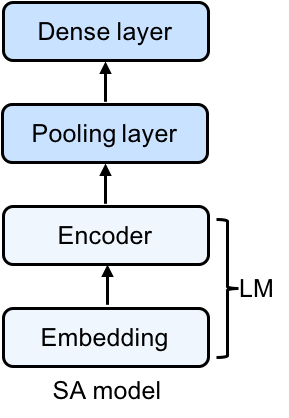

# Sentiment Analysis (SA) with pre-trained Language Model (LM)

Now that we've covered some advanced topics, let's go back and show how these techniques can help us even when addressing the comparatively simple problem of classification. In particular, we'll look at the classic problem of sentiment analysis: taking an input consisting of a string of text and classifying its sentiment as positive of negative.

In this notebook, we are going to use GluonNLP to build a sentiment analysis model whose weights are initialized based on a pretrained language model. Using pretrained language model weights is a common approach for semi-supervised learning in NLP. In order to do a good job with large language modeling on a large corpus of text, our model must learn representations that contain information about the structure of natural language. Intuitively, by starting with these good features, vs random features, we're able to converge faster upon a good model for our downsteam task.

With GluonNLP, we can quickly prototype the model and it's easy to customize. The building process consists of just three simple steps. For this demonstration we'll focus on movie reviews from the Large Movie Review Dataset, also known as the IMDB dataset. Given a movie, our model will output prediction of its sentiment, which can be positive or negative.


## Load mxnet and gluonnlp

```{.python .input  n=1}
import warnings
warnings.filterwarnings('ignore')

import random
import time
import multiprocessing as mp
import numpy as np

import mxnet as mx
from mxnet import nd, gluon, autograd

import gluonnlp as nlp

random.seed(123)
np.random.seed(123)
mx.random.seed(123)
```

## Sentiment analysis model with pre-trained language model encoder

So that we can easily transplant the pre-trained weights, we'll base our model architecture on the pre-trained LM. Following the LSTM layer, we have one representation vector for each word in the sentence. Because we plan to make a single prediction (not one per word), we'll first pool our predictions across time steps before feeding them through a dense layer to produce our final prediction (a single sigmoid output node).



Specifically, our model represents input words by their embeddings. Following the embedding layer, our model consists of a two-layer LSTM, followed by an average pooling layer, followed by a sigmoid output layer (all illustrated in the figure above)

Thus, given an input sequence, the memory cells in the LSTM layer will produce a representation sequence. This representation sequence is then averaged over all timesteps resulting in a fixed-length sentence representation $h$. Finally, we apply a sigmoid output layer on top of $h$. We’re using the sigmoid  because we’re trying to predict if this text has positive or negative sentiment, and a sigmoid activation function squashes the output values to the range [0,1], allowing us to interpret this output as a probability.

```{.python .input  n=11}
class MeanPoolingLayer(gluon.HybridBlock):
    """A block for mean pooling of encoder features"""
    def __init__(self, prefix=None, params=None):
        super(MeanPoolingLayer, self).__init__(prefix=prefix, params=params)

    def hybrid_forward(self, F, data, valid_length): # pylint: disable=arguments-differ
        """Forward logic"""
        # Data will have shape (T, N, C)
        masked_encoded = F.SequenceMask(data,
                                        sequence_length=valid_length,
                                        use_sequence_length=True)
        agg_state = F.broadcast_div(F.sum(masked_encoded, axis=0),
                                    F.expand_dims(valid_length, axis=1))
        return agg_state


class SentimentNet(gluon.HybridBlock):
    """Network for sentiment analysis."""
    def __init__(self, dropout, prefix=None, params=None):
        super(SentimentNet, self).__init__(prefix=prefix, params=params)
        with self.name_scope():
            self.embedding = None # will set with lm embedding later
            self.encoder = None # will set with lm encoder later
            self.agg_layer = MeanPoolingLayer()
            self.output = gluon.nn.HybridSequential()
            with self.output.name_scope():
                self.output.add(gluon.nn.Dropout(dropout))
                self.output.add(gluon.nn.Dense(1, flatten=False))

    def hybrid_forward(self, F, data, valid_length): # pylint: disable=arguments-differ
        encoded = self.encoder(self.embedding(data))  # Shape(T, N, C)
        agg_state = self.agg_layer(encoded, valid_length)
        out = self.output(agg_state)
        return out
```

## Hyperparameters and model initialization

### Hyperparameters

Our model is based on a standard LSTM model. We use a hidden size of 200. We use bucketing for speeding up the processing of variable-length sequences.

```{.python .input  n=2}
dropout = 0
language_model_name = 'standard_lstm_lm_200'
pretrained = True
learning_rate, batch_size = 0.005, 16
bucket_num, bucket_ratio = 10, 0.2
epochs = 1
grad_clip = None
log_interval = 100
```

```{.python .input  n=3}
context = mx.gpu(0)
```

### Load pre-trained model

```{.python .input}
lm_model, vocab = nlp.model.get_model(name=language_model_name,
                                      dataset_name='wikitext-2',
                                      pretrained=pretrained,
                                      ctx=context,
                                      dropout=dropout)
```

### Create SA model from pre-trained model

```{.python .input}
net = SentimentNet(dropout=dropout)
net.embedding = lm_model.embedding
net.encoder = lm_model.encoder
net.hybridize()
net.output.initialize(mx.init.Xavier(), ctx=context)
print(net)
```

In the above code, we first acquire a pre-trained model on the Wikitext-2 dataset using nlp.model.get_model. We then construct a SentimentNet object, which takes as input the embedding layer and encoder of the pre-trained model.

As we employ the pre-trained embedding layer and encoder, **we only need to initialize the output layer** using `net.out_layer.initialize(mx.init.Xavier(), ctx=context)`.

## Data pipeline

### Load sentiment analysis dataset -- IMDB reviews

In the labeled train/test sets, out of a max score of 10, a negative review has a score of no more than 4, and a positive review has a score of no less than 7. Thus reviews with more neutral ratings are not included in the train/test sets. We labeled a negative review whose score <= 4 as 0, and a
positive review whose score >= 7 as 1. As the neural ratings are not
included in the datasets, we can use 5 as our threshold.

```{.python .input}
# tokenizer takes as input a string and outputs a list of tokens.
tokenizer = nlp.data.SpacyTokenizer('en')

# length_clip takes as input a list and outputs a list with maximum length 500.
length_clip = nlp.data.ClipSequence(500)

def preprocess(x):
    data, label = x
    label = int(label > 5)
    # A token index or a list of token indices is
    # returned according to the vocabulary.
    data = vocab[length_clip(tokenizer(data))]
    return data, label

def get_length(x):
    return float(len(x[0]))

# Load the dataset
train_dataset, test_dataset = [nlp.data.IMDB(root='data/imdb', segment=segment)
                               for segment in ('train', 'test')]
print('Tokenize using spaCy...')

def preprocess_dataset(dataset):
    start = time.time()
    with mp.Pool() as pool:
        # Each sample is processed in an asynchronous manner.
        dataset = gluon.data.SimpleDataset(pool.map(preprocess, dataset))
        lengths = gluon.data.SimpleDataset(pool.map(get_length, dataset))
    end = time.time()
    print('Done! Tokenizing Time={:.2f}s, #Sentences={}'.format(end - start, len(dataset)))
    return dataset, lengths

# Preprocess the dataset
train_dataset, train_data_lengths = preprocess_dataset(train_dataset)
test_dataset, test_data_lengths = preprocess_dataset(test_dataset)
```

In the following code, we use FixedBucketSampler, which assigns each data sample to a fixed bucket based on its length. The bucket keys are either given or generated from the input sequence lengths and the number of buckets.

```{.python .input}
def get_dataloader():
    # Construct the DataLoader
    # Pad data, stack label and lengths
    batchify_fn = nlp.data.batchify.Tuple(
        nlp.data.batchify.Pad(axis=0, ret_length=True),
        nlp.data.batchify.Stack(dtype='float32'))
    batch_sampler = nlp.data.sampler.FixedBucketSampler(
        train_data_lengths,
        batch_size=batch_size,
        num_buckets=bucket_num,
        ratio=bucket_ratio,
        shuffle=True)
    print(batch_sampler.stats())
    train_dataloader = gluon.data.DataLoader(
        dataset=train_dataset,
        batch_sampler=batch_sampler,
        batchify_fn=batchify_fn)
    test_dataloader = gluon.data.DataLoader(
        dataset=test_dataset,
        batch_size=batch_size,
        shuffle=False,
        batchify_fn=batchify_fn)
    return train_dataloader, test_dataloader

train_dataloader, test_dataloader = get_dataloader()
```

## Training

### Evaluation using loss and accuracy

```{.python .input}
def evaluate(net, dataloader, context):
    loss = gluon.loss.SigmoidBCELoss()
    total_L = 0.0
    total_sample_num = 0
    total_correct_num = 0
    start_log_interval_time = time.time()
    print('Begin Testing...')
    for i, ((data, valid_length), label) in enumerate(dataloader):
        data = mx.nd.transpose(data.as_in_context(context))
        valid_length = valid_length.as_in_context(context).astype(np.float32)
        label = label.as_in_context(context)
        output = net(data, valid_length)
        L = loss(output, label)
        pred = (output > 0.5).reshape(-1)
        total_L += L.sum().asscalar()
        total_sample_num += label.shape[0]
        total_correct_num += (pred == label).sum().asscalar()
        if (i + 1) % log_interval == 0:
            print('[Batch {}/{}] elapsed {:.2f} s'.format(
                i + 1, len(dataloader),
                time.time() - start_log_interval_time))
            start_log_interval_time = time.time()
    avg_L = total_L / float(total_sample_num)
    acc = total_correct_num / float(total_sample_num)
    return avg_L, acc
```

In the following code, we use FixedBucketSampler, which assigns each data sample to a fixed bucket based on its length. The bucket keys are either given or generated from the input sequence lengths and number of the buckets.

```{.python .input}
def train(net, context, epochs):
    trainer = gluon.Trainer(net.collect_params(), 'ftml',
                            {'learning_rate': learning_rate})
    loss = gluon.loss.SigmoidBCELoss()

    parameters = net.collect_params().values()

    # Training/Testing
    for epoch in range(epochs):
        # Epoch training stats
        start_epoch_time = time.time()
        epoch_L = 0.0
        epoch_sent_num = 0
        epoch_wc = 0
        # Log interval training stats
        start_log_interval_time = time.time()
        log_interval_wc = 0
        log_interval_sent_num = 0
        log_interval_L = 0.0

        for i, ((data, length), label) in enumerate(train_dataloader):
            L = 0
            wc = length.sum().asscalar()
            log_interval_wc += wc
            epoch_wc += wc
            log_interval_sent_num += data.shape[1]
            epoch_sent_num += data.shape[1]
            with autograd.record():
                output = net(data.as_in_context(context).T,
                             length.as_in_context(context)
                                   .astype(np.float32))
                L = L + loss(output, label.as_in_context(context)).mean()
            L.backward()
            # Clip gradient
            if grad_clip:
                gluon.utils.clip_global_norm(
                    [p.grad(context) for p in parameters],
                    grad_clip)
            # Update parameter
            trainer.step(1)
            log_interval_L += L.asscalar()
            epoch_L += L.asscalar()
            if (i + 1) % log_interval == 0:
                print(
                    '[Epoch {} Batch {}/{}] elapsed {:.2f} s, '
                    'avg loss {:.6f}, throughput {:.2f}K wps'.format(
                        epoch, i + 1, len(train_dataloader),
                        time.time() - start_log_interval_time,
                        log_interval_L / log_interval_sent_num, log_interval_wc
                        / 1000 / (time.time() - start_log_interval_time)))
                # Clear log interval training stats
                start_log_interval_time = time.time()
                log_interval_wc = 0
                log_interval_sent_num = 0
                log_interval_L = 0
        end_epoch_time = time.time()
        test_avg_L, test_acc = evaluate(net, test_dataloader, context)
        print('[Epoch {}] train avg loss {:.6f}, test acc {:.2f}, '
              'test avg loss {:.6f}, throughput {:.2f}K wps'.format(
                  epoch, epoch_L / epoch_sent_num, test_acc, test_avg_L,
                  epoch_wc / 1000 / (end_epoch_time - start_epoch_time)))
```

```{.python .input}
train(net, context, epochs)
```

```{.python .input}
net(
    mx.nd.reshape(
        mx.nd.array(vocab[['This', 'movie', 'is', 'amazing']], ctx=context),
        shape=(-1, 1)), mx.nd.array([4], ctx=context)).sigmoid()
```

## Practice
- Try with a negative sample. Does the network correctly predict the sentiment?

## Conclusion

We built a Sentiment Analysis by reusing the feature extractor from a pre-trained language model. The modular design of Gluon blocks makes it very easy to put together models for various needs. GluonNLP provides powerful building blocks that substantially simplify the process of constructing efficient data pipeline and versatile models.

Gluonnlp documentation is here: http://gluon-nlp.mxnet.io/index.html
