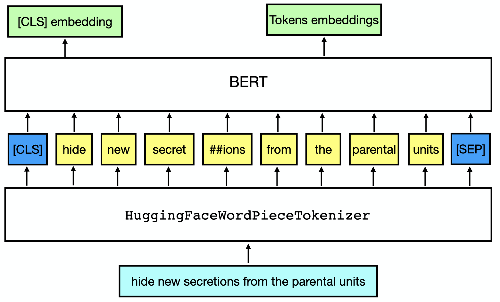

# Part 1: Quickstart of Pretrained Backbones

In this section, we will load two datasets using the `nlp_data` command and then try out different backbone models.


```{.python .input}
import numpy as np
import pandas as pd
import mxnet as mx
import gluonnlp
from gluonnlp.utils import set_seed
np.set_printoptions(suppress=True, threshold=5)

mx.npx.set_np()
set_seed(123)
```

## Load the Dataset

Let's download two datasets from the [GLUE benchmark](https://gluebenchmark.com/):
- The Standford Sentiment Treebank (SST-2)
- Semantic Textual Similarity Benchmark (STS-B)

In GluonNLP, we can use `nlp_data` to download the dataset. The downloaded dataset has been preprocessed to the [parquet](https://parquet.apache.org/) format that can be loaded by [pandas](https://pandas.pydata.org/).

```{.shell .input}
!nlp_data prepare_glue --benchmark glue -t sst
!nlp_data prepare_glue --benchmark glue -t sts
```


```{.python .input}
sst_train_df = pd.read_parquet('glue/sst/train.parquet')
sst_valid_df = pd.read_parquet('glue/sst/dev.parquet')
sst_train_df.head(10)
```


```{.python .input}
sts_train_df = pd.read_parquet('glue/sts/train.parquet')
sts_valid_df = pd.read_parquet('glue/sts/dev.parquet')
sts_train_df.head(10)
```

## Quickstart of Pretrained Backbones

A bunch of recent papers, especially [BERT](https://arxiv.org/pdf/1810.04805.pdf), have led a new trend for solving NLP problems:
- Pretrain a backbone model on a large corpus,
- Finetune the backbone to solve the specific NLP task.

GluonNLP provides the interface for using the pretrained backbone models.


```{.python .input}
from gluonnlp.models import get_backbone
model_name = 'google_en_cased_bert_base'
model_cls, cfg, tokenizer, local_params_path, _ = get_backbone(model_name)
```


```{.python .input}
print('- Model Class:')
print(model_cls)
```


```{.python .input}
print('- Configuration:')
print(cfg)
```


```{.python .input}
print('- Tokenizer:')
print(tokenizer)
```


```{.python .input}
print('- Path of the weights:')
print(local_params_path)
```

### Create the Backbone

To create a new backbone model in Gluon, you can just use the following commands. Here, as shown in the first example, `backbone.hybridize()` allows computation to be done using the symbolic backend.


```{.python .input}
backbone = model_cls.from_cfg(cfg)
backbone.hybridize()
backbone.load_parameters(local_params_path)
```

You can directly use the `backbone` to extract the contextual embeddings.

For BERT, it will output one embedding vector for the whole sentence --- `cls_embedding` and a bounch of contextual embedding vectors for each token --- `token_embeddings`.


```{.python .input}
text_input = sst_train_df['sentence'][0]
token_ids = mx.np.array([[tokenizer.vocab.cls_id] +
                         tokenizer.encode(text_input, int) + [tokenizer.vocab.sep_id]])
token_types = mx.np.array([0] * len(token_ids[0]))
valid_length = mx.np.array([len(token_ids[0])])
token_embeddings, cls_embedding = backbone(token_ids, token_types, valid_length)
```

<center></center>


```{.python .input}
print(cls_embedding.shape)
print('CLS Embedding =')
print(cls_embedding)
```


```{.python .input}
print(token_embeddings.shape)
print('Token Embeddings =')
print(token_embeddings)
```

### More Backbone Models in GluonNLP

Apart from BERT, GluonNLP has provided other backbone models including the recent models like [XLM-R](https://arxiv.org/pdf/1911.02116.pdf), [ALBERT](https://arxiv.org/pdf/1909.11942.pdf), [ELECTRA](https://openreview.net/pdf?id=r1xMH1BtvB), and [MobileBERT](https://arxiv.org/pdf/2004.02984.pdf). We can use `list_backbone_names` to list all the backbones that are supported in GluonNLP.


```{.python .input}
from gluonnlp.models import list_backbone_names
list_backbone_names()
```

It is straightforward to load the other models by specifying the name of the model. Here, let's compare the number of parameters of BERT and MobileBERT based on `get_backbone`.


```{.python .input}
from gluonnlp.utils.misc import count_parameters
param_num_l = []
for name in ['google_en_uncased_bert_base',
             'google_uncased_mobilebert']:
    model_cls, cfg, tokenizer, local_params_path, _ = get_backbone(name)
    model = model_cls.from_cfg(cfg)
    model.hybridize()
    model.initialize()
    total_num_params, fixed_num_params = count_parameters(model.collect_params())
    mx.npx.waitall()
    param_num_l.append((name, int(total_num_params / 1000000)))
df = pd.DataFrame(param_num_l, columns=['Model', '#Params (MB)'])
df
```

According to [the paper](https://arxiv.org/pdf/2004.02984.pdf) and our own experiments, MobileBERT performs similar to BERT-base, is faster for inference, and takes less GPU memory. We will thus later show how to finetune MobileBERT to solve the text prediction problem.
