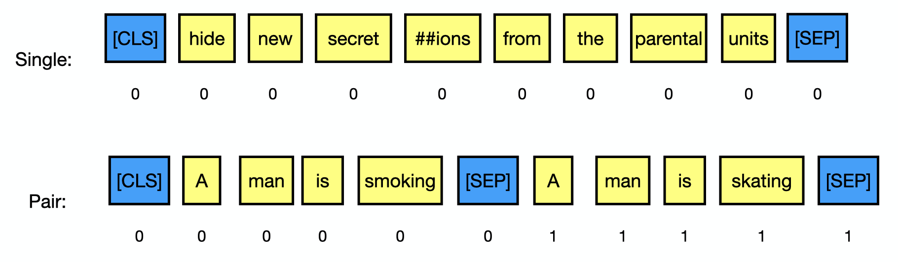

# Part2: MobileBERT for Text Prediction

Now you have learned 1) the basics about Gluon, 2) how to load the backbone models in GluonNLP. In this part, we are going to build a model that finetunes [MobileBERT](https://arxiv.org/pdf/2004.02984.pdf) for text prediction problems.


```{.python .input}
import gluonnlp
import numpy as np
import mxnet as mx
import pandas as pd
import matplotlib.pyplot as plt
from tqdm import tqdm
from mxnet.gluon import nn
from gluonnlp.models import get_backbone
from gluonnlp.utils.parameter import clip_grad_global_norm
from gluonnlp.utils.preprocessing import get_trimmed_lengths
from gluonnlp.utils.misc import get_mxnet_visible_ctx, grouper, repeat
from mxnet.gluon.data import batchify as bf
from mxnet.gluon.data import DataLoader
from mxnet.lr_scheduler import PolyScheduler
from gluonnlp.utils import set_seed
mx.npx.set_np()
np.set_printoptions(precision=2, suppress=True, threshold=5)
set_seed(123)
```

### Load Dataset

As mentioned in the previous section, we can load the dataset via `nlp_data`. We load the Stanford Sentiment Treebank (SST) dataset and the Semantic Textual Similarity (STS) dataset.

```{.shell .input}
!nlp_data prepare_glue --benchmark glue -t sst
!nlp_data prepare_glue --benchmark glue -t sts
```

For simplicity, we randomly choose 2000 samples from SST as our training data.


```{.python .input}
sst_train_df = pd.read_parquet('glue/sst/train.parquet')
# For simplicity, we just use 2000 samples for training for SST
rng_state = np.random.RandomState(123)
train_perm = rng_state.permutation(len(sst_train_df))
# Just use 2000 samples for training
sst_train_df = sst_train_df.iloc[train_perm[:2000]]
sst_dev_df = pd.read_parquet('glue/sst/dev.parquet')
```


```{.python .input}
sst_train_df.head(5)
```


```{.python .input}
# Load STS
sts_train_df = pd.read_parquet('glue/sts/train.parquet')[['sentence1', 'sentence2', 'score']]
sts_dev_df = pd.read_parquet('glue/sts/dev.parquet')[['sentence1', 'sentence2', 'score']]
```


```{.python .input}
sts_train_df.head(5)
```

### Load MobileBERT

We load the MobileBERT via `get_backbone`.


```{.python .input}
model_cls, cfg, tokenizer, local_params_path, _ = get_backbone('google_uncased_mobilebert')
backbone = model_cls.from_cfg(cfg)
```

### Preprocess the Data

There are two scenarios, a single sentence and multiple sentences.


- <font color='red'>[CLS]</font> TOKENS <font color='red'>[SEP]</font>
- <font color='red'>[CLS]</font> TOKENS1 <font color='red'>[SEP]</font> TOKENS2 <font color='red'>[SEP]</font>

<center></center>


```{.python .input}
def preprocess_data(df, feature_columns, label_column, tokenizer,
                    max_length=128, use_label=True, use_tqdm=True):
    out = []
    if isinstance(feature_columns, str):
        feature_columns = [feature_columns]
    cls_id = tokenizer.vocab.cls_id
    sep_id = tokenizer.vocab.sep_id
    iterator = tqdm(df.iterrows(), total=len(df)) if use_tqdm else df.iterrows()
    for idx, row in iterator:
        # Token IDs =      [CLS]    token_ids1       [SEP]      token_ids2         [SEP]
        # Segment IDs =      0         0               0           1                 1
        encoded_text_l = [tokenizer.encode(row[col_name], int)
                          for col_name in feature_columns]
        trimmed_lengths = get_trimmed_lengths([len(ele) for ele in encoded_text_l],
                                              max_length=max_length - len(feature_columns) - 1,
                                              do_merge=True)
        token_ids = [cls_id] + sum([ele[:length] + [sep_id]
                          for length, ele in zip(trimmed_lengths, encoded_text_l)], [])
        token_types = [0] + sum([[i % 2] * (length + 1)
                                 for i, length in enumerate(trimmed_lengths)], [])
        valid_length = len(token_ids)
        feature = (token_ids, token_types, valid_length)
        if use_label:
            label = row[label_column]
            out.append((feature, label))
        else:
            out.append(feature)
    return out
```


```{.python .input}
processed_sst_train = preprocess_data(sst_train_df, 'sentence', 'label', tokenizer, use_label=True)
print('Sentence = "{}"'.format(sst_train_df.iloc[0]['sentence']), ', Label =', sst_train_df.iloc[0]['label'])
print('After processing:', processed_sst_train[0])
```


```{.python .input}
processed_sts_train = preprocess_data(sts_train_df, ['sentence1', 'sentence2'], 'score', tokenizer, use_label=True)
print('Sentence1 = "{}"'.format(sts_train_df.iloc[0]['sentence1']),
      ', Sentence1 = "{}"'.format(sts_train_df.iloc[0]['sentence2']),
      ', Score =', sts_train_df.iloc[0]['score'])
print('After processing:', processed_sts_train[0])
```

### Handle Variable Length Sequence

When sample minibatches for text classification/regression, each text **may not have the same length**. You can use the built-in batchify functions in Gluon to help convert the data into batches.

Recall that we have,
- Train Sample: `((token_ids, token_types, valid_length), label)`
- Valid Sample: `(token_ids, token_types, valid_length)`

The corresponding batchify can be constructed similar to the python typing notation
- Train: `Group[Group[Pad, Pad, Stack], Stack]`
- Valid: `Group[Pad, Pad, Stack]`

Let's construct and test the batchify.


```{.python .input}
train_batchify = bf.Group(bf.Group(bf.Pad(), bf.Pad(), bf.Stack()),
                          bf.Stack())
dev_batchify = bf.Group(bf.Pad(), bf.Pad(), bf.Stack())
print('Train Sample1 Length = {}, Train Sample2 Length = {}'.format(len(processed_sst_train[0][0][0]),
                                                          len(processed_sst_train[1][0][0])))
train_batch = train_batchify([processed_sst_train[0], processed_sst_train[1]])
print('Train Batch Token ID shape =', train_batch[0][0].shape)
print(train_batch[0][0])
```

### Construct the Network

Next, let's construct a very simple network that uses the backbone to encode the sentence and adds another fully-connected layer to map the features into scores.


```{.python .input}
class TextPredictionNet(nn.HybridBlock):
    def __init__(self, backbone, in_units, out_units):
        super().__init__()
        self.backbone = backbone
        self.out_proj = nn.Dense(in_units=in_units,
                                 units=out_units,
                                 flatten=False)

    def hybrid_forward(self, F, data, token_types, valid_length):
        _, pooled_out = self.backbone(data, token_types, valid_length)
        out = self.out_proj(pooled_out)
        return out

    def initialize_with_pretrained_backbone(self, backbone_params_path, ctx=None):
        self.backbone.load_parameters(backbone_params_path, ctx=ctx)
        self.out_proj.initialize(ctx=ctx)
```


```{.python .input}
ctx_l = get_mxnet_visible_ctx()
net_sst = TextPredictionNet(backbone, backbone.units, 2)
net_sst.hybridize()
net_sst.initialize_with_pretrained_backbone(local_params_path, ctx_l)
```

### Train and Evaluate

Next, we can write the training loop. Here, we will use the [ADAMW optimizer](https://arxiv.org/pdf/1711.05101.pdf), gradient clipping and [Slanted Triangular Learning Rate](https://arxiv.org/pdf/1801.06146.pdf) scheduler.


```{.python .input}
total_iterations = 1000
warmup = 100
x = np.arange(total_iterations)
max_lr = 1E-4
y = (x < warmup) * max_lr * x / warmup + (x >= warmup) * (total_iterations - x) * max_lr / (total_iterations - warmup)
plt.plot(x, y)
plt.xlabel("Iterations")
plt.ylabel("Learning Rate")
plt.title('Slanted Triangular Learning Rate')
```


```{.python .input}
def train(batch_size, dataset, batchify_function, net, ctx_l,
          num_epochs, lr=1E-4, wd=0.01, max_grad_norm=1.0, warmup_ratio=0.1,
          loss_function='nll'):
    assert batch_size % len(ctx_l) == 0
    per_device_batch_size = batch_size // len(ctx_l)
    epoch_num_updates = len(dataset) // batch_size
    max_update = epoch_num_updates * num_epochs
    warmup_steps = int(np.ceil(max_update * warmup_ratio))
    dataloader = DataLoader(dataset,
                            batch_size=per_device_batch_size,
                            batchify_fn=batchify_function,
                            num_workers=4,
                            shuffle=True)
    dataloader = grouper(repeat(dataloader), len(ctx_l))
    
    # Construct the learning rate scheduler
    lr_scheduler = PolyScheduler(max_update=max_update,
                                 base_lr=lr,
                                 warmup_begin_lr=0.0,
                                 pwr=1,
                                 final_lr=0.0,
                                 warmup_steps=warmup_steps,
                                 warmup_mode='linear')
    optimizer_params = {'learning_rate': lr,
                        'wd': wd,
                        'lr_scheduler': lr_scheduler}
    trainer = mx.gluon.Trainer(net.collect_params(),
                               'adamw',
                               optimizer_params)
    params = [p for p in net.collect_params().values() if p.grad_req != 'null']
    log_loss = 0
    log_gnorm = 0
    log_step = 0
    log_interval = int(epoch_num_updates * 0.5)
    for i in range(max_update):
        sample_l = next(dataloader)
        loss_l = []
        for sample, ctx in zip(sample_l, ctx_l):
            (token_ids, token_types, valid_length), label = sample
            # Move to the corresponding context
            token_ids = mx.np.array(token_ids, ctx=ctx)
            token_types = mx.np.array(token_types, ctx=ctx)
            valid_length = mx.np.array(valid_length, ctx=ctx)
            label = mx.np.array(label, ctx=ctx)
            with mx.autograd.record():
                scores = net(token_ids, token_types, valid_length)
                if loss_function == 'nll':
                    logits = mx.npx.log_softmax(scores, axis=-1)
                    loss = - mx.npx.pick(logits, label)
                elif loss_function == 'mse':
                    loss = mx.np.square(scores[:, 0] - label)
                else:
                    raise NotImplementedError
                loss_l.append(loss.mean() / len(ctx_l))
        for loss in loss_l:
            loss.backward()
        trainer.allreduce_grads()
        # Begin Norm Clipping
        total_norm, ratio, is_finite = clip_grad_global_norm(params, max_grad_norm)
        trainer.update(1.0)
        step_loss = sum([loss.asnumpy() for loss in loss_l])
        log_loss += step_loss
        log_gnorm += total_norm
        log_step += 1
        if log_step >= log_interval or i == max_update - 1:
            print('[Iter {} / {}] avg {} = {:.2f}, avg gradient norm = {:.2f}'.format(i + 1,
                                                                                      max_update,
                                                                                      loss_function,
                                                                                      log_loss / log_step,
                                                                                      log_gnorm / log_step))
            log_loss = 0
            log_gnorm = 0
            log_step = 0
```


```{.python .input}
train(64, processed_sst_train, train_batchify, net_sst, ctx_l,
      num_epochs=3,
      lr=5E-4,
      loss_function='nll')
```


```{.python .input}
def predict(batch_size, df, feature_columns, tokenizer,
            batchify_function, net, ctx_l, classification=True):
    if not isinstance(df, pd.DataFrame):
        df = pd.DataFrame(df)
    dataset = preprocess_data(df, feature_columns, None, tokenizer, use_label=False, use_tqdm=False)
    per_device_batch_size = (batch_size + len(ctx_l) - 1) // len(ctx_l)
    dataloader = DataLoader(dataset,
                            batch_size=per_device_batch_size,
                            batchify_fn=batchify_function,
                            shuffle=False)
    pred = []
    for sample_l in grouper(dataloader, len(ctx_l)):
        for sample, ctx in zip(sample_l, ctx_l):
            if sample is None:
                continue
            token_ids, token_types, valid_length = sample
            token_ids = mx.np.array(token_ids, ctx=ctx)
            token_types = mx.np.array(token_types, ctx=ctx)
            valid_length = mx.np.array(valid_length, ctx=ctx)
            scores = net(token_ids, token_types, valid_length)
            if classification:
                probs = mx.npx.softmax(scores, axis=-1)
                pred.append(probs.asnumpy())
            else:
                pred.append(scores.asnumpy())
    pred = np.concatenate(pred, axis=0)
    return pred
```


```{.python .input}
pred = predict(64, sst_dev_df, 'sentence', tokenizer, dev_batchify, net_sst, ctx_l)
accuracy = (pred.argmax(axis=-1) == sst_dev_df['label']).sum() / len(sst_dev_df)
print('Accuracy of the Dev Set=', accuracy)
```


```{.python .input}
sentence1 = 'GluonNLP helps you solve practical NLP problems!'
sentence2 = 'GluonNLP is difficult to use and is not good for NLP.'
pred2 = predict(64, {'sentence': [sentence1, sentence2]},
                'sentence', tokenizer, dev_batchify, net_sst, ctx_l)
print('Sentence 1')
print('----------')
print(sentence1)
print('Probability =', pred[0], ', Is Positive?', pred[0].argmax() == 1)
print()
print('Sentence 2')
print('----------')
print(sentence2)
print('Probability =', pred[1], ', Is Positive?', pred[1].argmax() == 1)
```

### Train for Sentence Similarity

Similarly, we are able to train the model for sentence similarity. Since it is a regression problem, we use mean squared error (MSE) as the loss function.


```{.python .input}
net_sts = TextPredictionNet(backbone, backbone.units, 1)
net_sts.hybridize()
net_sts.initialize_with_pretrained_backbone(local_params_path, ctx_l)
train(32, processed_sts_train, train_batchify, net_sts, ctx_l,
      num_epochs=3,
      lr=5E-4,
      loss_function='mse')
```


```{.python .input}
pred = predict(64, sts_dev_df, ['sentence1', 'sentence2'], tokenizer,
               dev_batchify, net_sts, ctx_l, classification=False)
mse = np.square((pred[:, 0] - sts_dev_df['score'])).mean()
print('MSE =', mse)
```


```{.python .input}
sentences = ['The child is riding a horse.',
             'The young boy is riding a horse.',
             'The young man is riding a horse.',
             'The young man is riding a bicycle.']

pred_dataset_df = pd.DataFrame([(sentences[0], sentences[1]),
                                (sentences[0], sentences[2]),
                                (sentences[0], sentences[3])],
                               columns=['sentence1', 'sentence2'])
pred = predict(64, pred_dataset_df, ['sentence1', 'sentence2'], tokenizer,
               dev_batchify, net_sts, ctx_l, classification=False)
pred_dataset_df['Predicted Score'] = pred
pred_dataset_df
```
