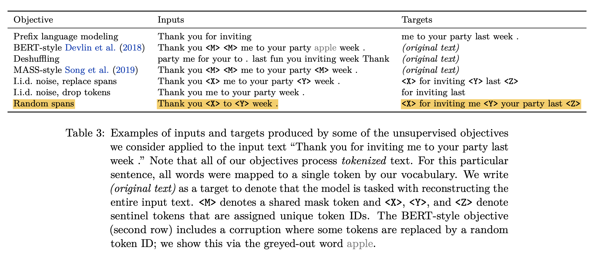

# T5 for Masked Language Modeling (MLM)

## Introduction

As we have seen in T5 model's paper [1], the author explored a pre-training technique called "random spans". As the name suggests, this method corrupts the input sequence by spans of tokens rather than individual tokens. After that, every noise spans is mapped to unique sentinel starting from `<extra_id_0>`, and the model's objective is to denoise these spans. By handling consequentive corrupted tokens altogether, this method yields significant speed-up as compared to BERT's objective while retain performance. 

<center></center>
<div align="center"> <strong>Figure 1:</strong> A comparison of different pretraining objectives (source: T5's paper [1]). </div>

In this tutorial, we are going to: 

1. Load a pretrained T5 model
2. Perform a MLM task on a simple example

## Preliminaries

To begin, we load required packages. We also set seeds so that you could replicate our results on your machine. In addition, two helper functions are introduced here for creating corrupted input and printing human-readable output. 


```{.python .input}
import random
import warnings
warnings.filterwarnings('ignore')

import numpy as _np
from mxnet import np, npx
from gluonnlp.data.batchify import Pad
from gluonnlp.models import get_backbone
from gluonnlp.models.t5 import T5Inference, mask_to_sentinel
from gluonnlp.sequence_sampler import BeamSearchSampler
```


```{.python .input}
npx.set_np()

random.seed(0)
np.random.seed(0)
npx.random.seed(0)
_np.random.seed(0)
```


```{.python .input}
def spans_to_masks(tokenizer, tokens, spans): 
    def _spans_to_masks(tokens, spans): 
        if isinstance(tokens[0], int): 
            masks = [0] * len(tokens)
            targets = []
            for i, span in enumerate(spans): 
                target = []
                for idx in span: 
                    assert 0 <= idx and idx < len(tokens), 'Span index out of range'
                    masks[idx] = 1
                    target.append(tokens[idx])
                sentinel = tokenizer.vocab.to_tokens(-1 - i)
                target_str = tokenizer.decode(target)
                targets.append(sentinel + ' ' + target_str)
                print('{} {}'.format(sentinel, target_str), end='\t')
            print()
            return masks, targets
        elif isinstance(tokens[0], list): 
            assert len(tokens) == len(spans), 'Every sample must have corresponding tokens and spans'
            masks = []
            targets = []
            for i, (tok, s) in enumerate(zip(tokens, spans)): 
                print('[Sample {}]'.format(i), end='\t')
                m, tgt = _spans_to_masks(tok, s)
                masks.append(m)
                targets.append(tgt)
            return masks, targets
        else: 
            raise TypeError('Unsupported type of tokens: {}'.format(type(tokens)))
    return _spans_to_masks(tokens, spans)


def print_results(tokenizer, output, spans, targets=None): 
    for sample in range(output[0].shape[0]): 
        print('[SAMPLE {}]'.format(sample))
        n_spans = len(spans[sample])
        if targets is not None: 
            print('(Target)\t{}'.format('\t'.join(targets[sample])))
        for beam in range(output[0].shape[1]): 
            print('(Beam {})'.format(beam), end='\t')
            ele_output = output[0][sample, beam, :enc_valid_length[sample].item()]
            for i in range(n_spans): 
                start = np.where(ele_output == len(tokenizer.vocab) - 1 - i)[0][0].item()
                end = min(start + 1 + len(spans[sample][i]), len(ele_output))
                sentinel = tokenizer.vocab.to_tokens(-1 - i)
                ele_tokens = ele_output[start + 1:end].tolist()
                print('{} {}'.format(sentinel, tokenizer.decode(ele_tokens)), end='\t')
            print()
        print()
```

## Load the Model

In GluonNLP, `get_backbone` is a handy way to load models and download pretrained weights (not limited to T5). Here, we choose T5-large for illustration purpose. Alternatively, you can specify `google_t5_small`, `google_t5_base`, `google_t5_3B`, or `google_t5_11B` as well. 

`T5Inference` uses `T5Model` as the backbone and leverages the incremental decoding feature. Notice that it must be initialized with a (pretrained) `T5Model` instance. 


```{.python .input}
T5Model, cfg, tokenizer, local_params_path, _ = get_backbone('google_t5_large')
backbone = T5Model.from_cfg(cfg)
backbone.load_parameters(local_params_path)
t5mlm = T5Inference(backbone)
t5mlm.hybridize()
```

For this MLM task, we will also utilize the `BeamSearchSampler`, a powerful and easy-to-use tools in many searching scenarios. 


```{.python .input}
beam_size = 4
t5mlm_seacher = BeamSearchSampler(beam_size, t5mlm, eos_id=1, vocab_size=32128)
```

Since the output of our tokenizer is a Python list (or nested Python list), each sample can be of different lengths. This design choise allows for more flexibilities in manipulating intermediate results, but requires an additional step before feeding into the model. `Pad` helps us group multiple samples into an ndarray batch with just one line of code. 


```{.python .input}
batcher = Pad(val=0, dtype=np.int32)
```

## A Toy Example

In this tutorial, we simply use a batch of two samples. We can inspect the tokenization results by passing `str` as the second argument. Notice that the tokenizer itself does not add EOS tokens, `</s>`, to the end of sequences. We leave the flexibility and responsibility to users. 


```{.python .input}
text = [
    'Andrew Carnegie famously said , " My heart is in the work . " At CMU , we think about work a little differently .', 
    'Peace is a concept of societal friendship and harmony in the absence of hostility and violence . In a social sense , peace is commonly used to mean a lack of conflict and freedom from fear of violence between individuals or groups .' 
]
tokens = tokenizer.encode(text, int)
for ele_tokens in tokens: 
    ele_tokens.append(1) # append the EOS token: </s>
```


```{.python .input}
for ele_tokens in tokenizer.encode(text, str): 
    print(ele_tokens, end='\n\n')
```

For simplicity, we just hard-code noise spans, although technically this should be a random process. Notice that every noise span corresponds to a tuple of token indices. 

We have converted a helper function, `mask_to_sentinel()`,  from the `noise_span_to_unique_sentinel()` in the original [T5 repository](https://github.com/google-research/text-to-text-transfer-transformer/blob/master/t5/data/preprocessors.py), which helps map noise spans to `<extra_id>` sentinels and collapse a span's tokens into a single sentinel. For the input, `tokens` and `masks` are required to have the exact shape. 
> For curious readers, there are many more useful implementations in T5's original repository. 


```{.python .input}
noise_spans = [
    [(11, 12, 13)], # for sequence 1
    [(4, 5, 6), (28, 29, 30), (46, 47, 48)] # for sequence 2
]
masks, targets = spans_to_masks(tokenizer, tokens, noise_spans)
masked_tokens = mask_to_sentinel(tokens, masks, len(tokenizer.vocab))
```

The preparation step completes as we batch-ify the encoder input tokens (which is corrupted sequences) and record valid length for each sample. 


```{.python .input}
enc_tokens = batcher(masked_tokens)
enc_valid_length = np.array([len(ele_tokens) for ele_tokens in masked_tokens], dtype=np.int32)
```

## Denoise Inference

We first get the initial states of decoder by calling `init_states()`. This method includes feeding the corrupted sequences into the encoder, initializing "past" keys and values in every decoder's layer to zero, etc. The returned states is a 4-tuple of encoded results, valid lengths of corrupted sequences, our position (index) in incremental decoding, and past key-values. 

Then, we initiate the beam search with a batch of `<pad>` tokens (token id = 0). The beam search will use incremental decoding implemented in `T5Inference` to speed up the process, although it may still take a while. 


```{.python .input}
states = t5mlm.init_states(enc_tokens, enc_valid_length)
output = t5mlm_seacher(np.zeros_like(enc_valid_length), states, enc_valid_length)
```

When the search is done, we can print the results nicely using our helper function, and compare them with the target. Happily, the pretrianed T5-large gives reasonable (and sometimes perfect) guess in our toy MLM task. 


```{.python .input}
print_results(tokenizer, output, noise_spans, targets)
```

## References

[1] Raffel, C., et al. "Exploring the Limits of Transfer Learning with a Unified Text-to-Text Transformer". JMLR 2020
